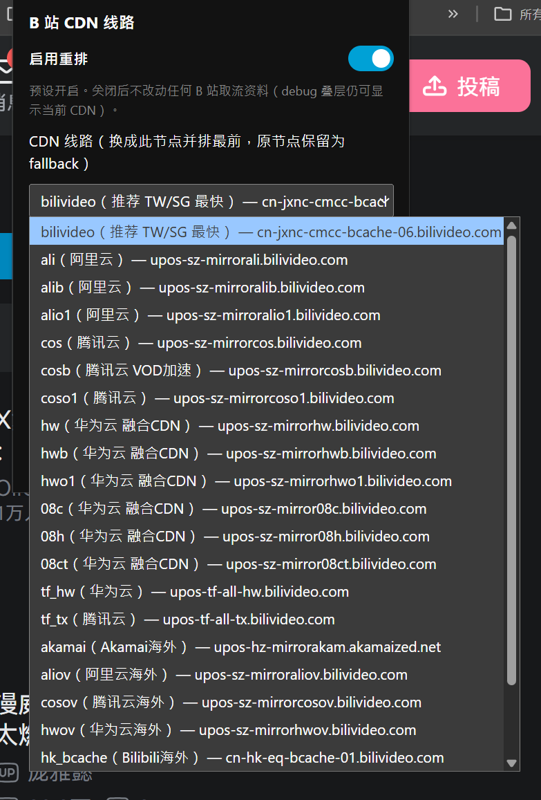
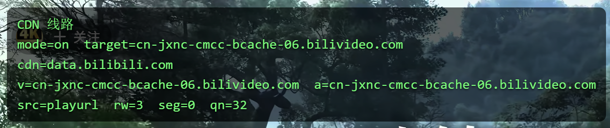

<div align="center">

# 🎬 B 站 CDN 线路重排

### 让 🇹🇼 台湾 / 🇸🇬 新加坡 用户看网页版 B 站更顺的 Chrome 扩充

`Manifest V3` · `Chrome 111+` · `纯前端 · 无需登入`

</div>

---

> ### 🙏 Credit / 致谢
>
> 本专案移植自作者 **[@roge4444](https://github.com/roge4444)** 的两个专案：
>
> - 📦 [PiliNaraRogerMod](https://github.com/roge4444/PiliNaraRogerMod)
> - 📦 [blblRogerMod](https://github.com/roge4444/blblRogerMod)
>
> CDN 选线策略与节点清单皆源自上述专案，**特别感谢作者** ❤️

---


---


## ✨ 这个扩充在做什么

**🎯 主要是为了让 🇹🇼 台湾 ／ 🇸🇬 新加坡 的使用者看网页版 B 站（www.bilibili.com）更顺。**

B 站预设分配的取流节点对台湾、新加坡使用者常常绕路、不够快。这个扩充会**把影片的取流 CDN 重排、换成一个对 TW/SG 较快的最优节点**，让缓冲与载入更顺。

| 功能 | 说明 |
|:--|:--|
| 🚀 **TW/SG 最优节点** | 预设换成对台/星最快的 CDN，开箱即用 |
| 🌐 **其他 CDN 节点** | 阿里云／腾讯云／华为云／Akamai／各海外节点…（来自 PiliNaraRogerMod），依所在地区自由比较切换 |
| ✏️ **自订选项** | 可自行输入任意 CDN host |
| 🛑 **原始（不覆写）** | 等同关闭，完全不动 B 站原生行为 |
| **debug 叠层** | 查看当前 CDN 节点 |

---

## 📥 安装（载入未封装扩充）

```text
1️⃣  下载／clone 本专案到本机
2️⃣  网址列输入 chrome://extensions 并前往
3️⃣  右上角把「开发人员模式 / Developer mode」打开
4️⃣  点左上「载入未封装项目 / Load unpacked」
5️⃣  ⚠️ 选择专案里的 src 资料夹（不是专案根目录！）
6️⃣  开一支 B 站影片 → 播放器左上出现 debug 叠层 → 点工具列图示调整设定
```

> ⚠️ **一定要选 `src/`**，因为 `manifest.json` 在 `src/` 里面。选到专案根目录会出现
> 「Manifest file is missing or unreadable」。

> 💡 改完程式码後，回到 `chrome://extensions` 点该扩充卡片上的 🔄 **重新载入**，再重整 B 站分页即可生效。

> 💡 需要 **Chrome 111+**（用到 content script 的 `world: "MAIN"`）。若是从 `dist/` 拿到 zip，
> 需先解压缩，再对解压出来的资料夹执行上面步骤。

---

## 🗂️ 专案结构

```text
bilibili-cdn-switcher/
├── src/                  ← 扩充本体（载入未封装 / 打包的就是这层）
│   ├── manifest.json
│   ├── popup.html
│   ├── popup.js
│   ├── main-hook.js      ← MAIN world：改写取流 URL
│   ├── bridge.js         ← ISOLATED world：storage ↔ 页面 桥接
│   ├── cdn-list.json     ← 节点清单
│   └── icons/            ← 16 / 32 / 48 / 128
├── dist/                 ← 打包产物（.zip，已 gitignore）
├── docs/                 ← README 用的截图
├── assets/               ← 图示母档 512px + 产生脚本
├── build.ps1             ← 打包成上架用 zip
└── README.md
```

### 📦 打包（上架 Chrome Web Store 用）

```powershell
pwsh -File build.ps1
```

会读 `src/manifest.json` 的 `version`，把 `src/` **底下的内容**（`manifest.json` 必须在 zip 最上层）
压成 `dist/bilibili-cdn-switcher-<版本>.zip`。

### 🎨 重新产生图示

```powershell
pwsh -File assets/gen-icons.ps1
```

以 512px 母档缩出 16/32/48/128 写入 `src/icons/`，并更新 `assets/icon-master.png`。

---

## 🎛️ UI 说明

| 选项 | 行为 |
|:--|:--|
| 🔘 **启用重排** | 预设 **开启** 的总开关；关闭後完全不改动 B 站取流（debug 叠层仍会显示当前 CDN） |
| 📡 **CDN 线路** | 下拉选单：**第一项＝预设＝ bilivideo（TW/SG 最快）**，其余为各家节点；倒数为「备用URL」「原始」「自订」。选「✏️ 自订」会跳出输入框自行输入 host |
| 🐛 **显示页面 debug 叠层** | 独立于重排开关，关闭重排时仍可显示当前 CDN，方便比较 |

<details>
<summary>🔍 <b>Debug 叠层长什么样</b>（播放器左上角，仿 blblRogerMod <code>PlayerActivityDebug</code> 风格）</summary>

```text
CDN 线路
mode=on  target=cn-jxnc-cmcc-bcache-06.bilivideo.com
cdn=<当前实际串流的 host>
v=<video 主用 host>  a=<audio 主用 host>
src=playinfo|playurl  rw=<改写次数>  seg=<分段差替数>  qn=<画质>
```

</details>

---

## 🗂️ 设定与档案

- 📋 节点清单放在 **`src/cdn-list.json`** —— 要新增／调整节点或注记，改这个档即可，于扩充页「重新整理」後生效。
- 🧩 每个项目格式：

  ```json
  { "value": "upos-sz-mirrorhw.bilivideo.com", "name": "hw", "note": "华为云 融合CDN" }
  ```

  `value` 特殊值：🛑 `base`＝不覆写 · 🔁 `backup`＝优先备用URL · ✏️ `__custom__`＝自订输入。

---

## ⚠️ 注意

- 🔒 一律保留原 host 为 `backupUrl` fallback，避免个别 host-bound URL 整段播不出。
- 📍 最优节点为 TW/SG 最佳化；其他地区使用者可自行切换到较近的节点或用「✏️ 自订」。

---

<div align="center">

Made with ❤️ for 🇹🇼 / 🇸🇬 bilibili viewers · 移植自 [@roge4444](https://github.com/roge4444)

</div>
