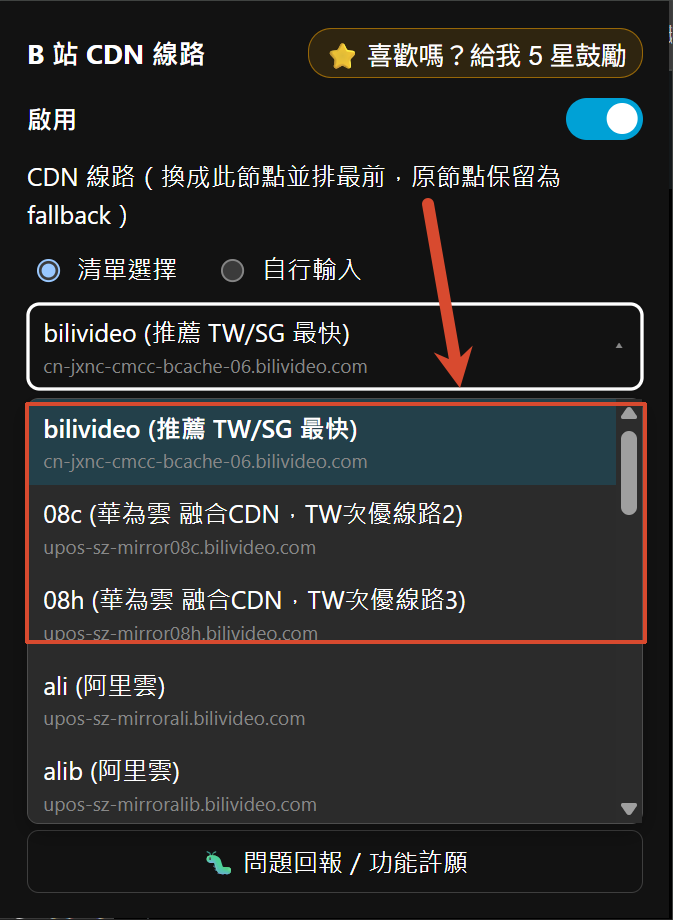
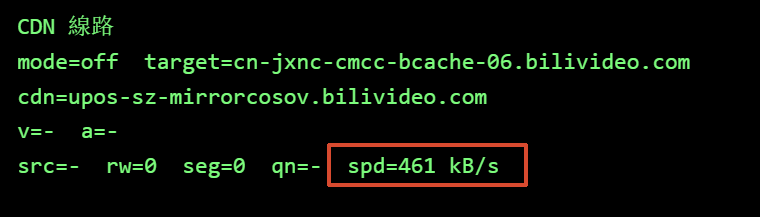
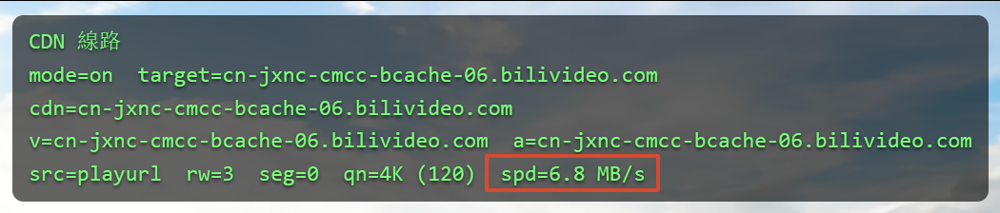

<div align="center">

# 🎬 Bilibili CDN Route Switcher

**Language:** [繁體中文](../README.md)｜[简体中文](README.zh-CN.md)｜English (this page)

### A Chrome / Edge / Firefox extension for smoother bilibili web playback in 🇹🇼 Taiwan / 🇸🇬 Singapore

### 📥 [Install from the Chrome Web Store](https://chromewebstore.google.com/detail/twsg-%E8%A7%86%E9%A2%91%E5%8A%A0%E9%80%9F-for-bilibili-%E9%9D%9E%E5%AE%98/dfaddcffoondcendifiljhdbdagebgch) ｜ [Install from Firefox Add-ons](https://addons.mozilla.org/zh-TW/firefox/addon/bilibili-cdn-switcher/)

</div>

---

> ### 🙏 Credit
>
> This project is ported from two projects by **[@roge4444](https://github.com/roge4444)**:
>
> - 📦 [PiliNaraRogerMod](https://github.com/roge4444/PiliNaraRogerMod)
> - 📦 [blblRogerMod](https://github.com/roge4444/blblRogerMod)
>
> The CDN routing strategy and node list are both sourced from the projects above — **huge thanks to the original author** ❤️

---


---

Before


After


## ✨ What this extension does

**🎯 It exists to make bilibili's web player (www.bilibili.com) smoother for 🇹🇼 Taiwan / 🇸🇬 Singapore viewers.**

Bilibili's default CDN assignment often routes Taiwan and Singapore users through slow, roundabout paths. This extension **reroutes the video-fetching CDN to a node that's faster for TW/SG**, reducing buffering and load times.

| Feature | Description |
|:--|:--|
| 🚀 **Best node for TW/SG** | Defaults to the fastest CDN for Taiwan/Singapore, works out of the box |
| 🌐 **Other CDN nodes** | Alibaba Cloud / Tencent Cloud / Huawei Cloud / Akamai / various overseas nodes… (sourced from PiliNaraRogerMod), freely switchable based on your region |
| ✏️ **Custom input** | A mode mutually exclusive with "choose from list"; enter any CDN host |
| 🛑 **Original (no override)** | Same as disabled — leaves bilibili's native behavior untouched |
| 🔁 **Automatic failover** | Detects failed segment requests or genuinely stalled playback (not just a full buffer) and silently switches to bilibili's own backup node first (with a toast, no full-page reload); if that backup also fails, it shows a persistent prompt letting you decide whether to switch to the Backup URL. Built-in, no toggle |
| 📶 **Per-node speed test** | A dedicated page showing the video title/quality; measures download speed for each node using segments from the current video and quality, listed one by one — retestable mid-run. **Read-only, never changes your selected CDN**; leaving the page stops the test immediately |
| 🌏 **Multi-language UI** | Automatically shows Traditional Chinese / Simplified Chinese / English based on your browser language, covering the popup, in-page toasts, and the debug overlay |
| 🐛 **Debug overlay** | Shows the currently active CDN node (off by default, toggle it in settings) |
| 🦊 **Chrome / Edge / Firefox** | A single `src/` tree; packaging produces a per-browser zip (Edge is Chromium-based and reuses Chrome's manifest as-is) |

---

## 🗂️ Project structure

```text
bilibili-cdn-switcher/
├── src/                  ← Extension source (this is what "Load unpacked" / packaging uses)
│   ├── manifest.json          ← Chrome / Edge
│   ├── manifest.firefox.json  ← Firefox (includes browser_specific_settings)
│   ├── popup.html / popup.js
│   ├── main-hook.js      ← MAIN world: rewrites stream URLs
│   ├── bridge.js         ← ISOLATED world: storage / i18n bridge to the page
│   ├── cdn-list.json     ← CDN node list
│   ├── _locales/{zh_TW,zh_CN,en}/  ← Three-language strings (manifest uses __MSG_x__; popup.js/main-hook.js look them up at runtime)
│   └── icons/            ← 16 / 32 / 48 / 128
├── dist/                 ← Packaged .zip output
├── docs/                 ← Screenshots for the README + the Simplified Chinese / English README
├── assets/               ← 512px icon master (icons-prod is generated by gen-icons.mjs)
├── store/                ← Store-listing screenshots / promo images
├── scripts/              ← All dev/build scripts, pure Node — runs on Windows / Mac / Linux
│   ├── build.mjs                 ← Packages store-ready zips (Chrome + Edge + Firefox)
│   ├── gen-icons.mjs             ← Regenerates icons
│   ├── make-screenshots.mjs      ← Scales images under docs/ and letterboxes them
│   └── capture-screenshots.mjs   ← Automates a browser to capture the store screenshots (see below)
├── package.json           ← Node deps for scripts/*.mjs (jszip / puppeteer / sharp)
└── README.md
```

Everything under `scripts/` is plain Node (zipping via [jszip](https://npm.im/jszip), image work via
[sharp](https://npm.im/sharp)) — no dependency on Windows-only PowerShell or System.Drawing, so it runs
the same way on a Mac. Just `npm install` once to pull in the dependencies.

### 📦 Packaging (for Chrome Web Store / Microsoft Edge Add-ons / Firefox Add-ons)

There's no compile/transpile step — `src/` is plain source you can `Load unpacked` directly. "Packaging"
just zips it up for store submission, and **there's no automation for it** (e.g. nothing runs on push) —
you need to run it by hand whenever `dist/` needs updating:

```bash
npm install                          # first run, or whenever node_modules has been wiped
npm run build                        # Default: package Chrome + Edge + Firefox
npm run build -- --browser=chrome    # Chrome only
npm run build -- --browser=edge      # Edge only
npm run build -- --browser=firefox
```

Chrome and Edge share `src/manifest.json` (Edge is Chromium-based and fully compatible with Chrome's
Manifest V3, so no separate manifest is needed); Firefox uses `src/manifest.firefox.json`. The script
reads `version` from the matching manifest and zips the **contents of `src/`** (with the chosen manifest
renamed to `manifest.json` at the zip root) into `dist/bilibili-cdn-switcher-<browser>-<version>.zip`.
The `version` in the Chrome and Firefox manifests must stay in sync — the script warns if they diverge
(Edge reuses Chrome's manifest, so its version is always in sync by construction).

The build is reproducible: as long as `src/` hasn't changed, packaging the same browser target always
produces byte-identical zips (Windows and Mac included), which makes it easy to check later on whether
`dist/` actually needs updating if this ever gets wired into CI.

### 🎨 Regenerating icons

```bash
npm run gen-icons
```

Scales the 512px master down to 16/32/48/128, producing two sets: `src/icons/` (dev build, with a red
badge dot — what `Load unpacked` normally reads, so it's easy to tell apart from an installed store
build) and `assets/icons-prod/` (store build, no badge). `scripts/build.mjs` automatically swaps in the
icons from `assets/icons-prod/` when packaging zips.

### 📸 Generating store screenshots (main / debug / speedtest × 3 locales, 9 files, 1200x800 jpg)

```bash
npm run capture-screenshots
```

Loads `src/` as an unpacked extension in Puppeteer, switches through the `en-US` / `zh-CN` / `zh-TW`
browser locales, and opens a real bilibili video page (the URL is `VIDEO_URL` at the top of
`scripts/capture-screenshots.mjs` — edit that line to swap videos). For each locale it captures the
popup's main screen, the on-page debug overlay, and the speed test mid-run, letterboxes each to
1200x800, and writes them into `store/`, overwriting the matching
`screenshot-<view>-<locale>-1200x800.jpg` files. It runs a real speed test against bilibili's CDNs, so
one full pass takes a few minutes and depends on network conditions.

---

## 🎛️ UI reference

| Option | Behavior |
|:--|:--|
| 🔘 **Enabled** | Master switch, **on** by default; when off, bilibili's stream fetching is left completely untouched (the debug overlay still shows the current CDN) |
| 📡 **CDN route** | "Choose from list" / "Custom input", mutually exclusive. **Default = choose from list, first entry = bilivideo (fastest for TW/SG)**, followed by other providers, with "Backup URL" and "Original" as the last two; switching to "Custom input" reveals a text field for your own host |
| 🔍 **Test node speeds** | Switches to a dedicated speed-test page showing the current video's title and quality; measures download speed for each node using segments from the current video/quality (whichever comes first of 8MB or 5s; only counts as a timeout if nothing at all arrives within 5s — a partial result under 8MB is shown as-is), rendering each row as "waiting / testing / result". Press "🔄 Retest" to rerun (works mid-test too, aborting the current run and starting fresh). **Read-only — never changes your selected CDN**; pressing "← Back" or closing the popup stops the test immediately. With "Enabled" on, testing is possible as soon as playurl is parsed, no need to wait for actual playback; with it off, a sample is only available after a real segment has been downloaded |
| 🔁 **Automatic CDN failover** | Built-in, **no toggle**; on detecting a failed segment request (403/404/5xx/network error) or genuinely stalled playback (progress frozen for 8s with no traffic on the wire), it first silently switches to bilibili's own backup node (swapped at the segment level, no full-page reload, with a toast shown); if that backup also can't play, it shows a persistent prompt letting you decide whether to "Reload and switch to Backup URL" |
| 🌏 **Language** | No manual switch — follows your browser/OS language, showing Traditional Chinese / Simplified Chinese / English automatically (other languages default to Traditional Chinese); to force a specific language, adjust your browser's language preference order |
| 🐛 **Show debug overlay on page** | **Off** by default; independent of the routing toggle — still shows the current CDN even when routing is disabled, useful for comparison |

<details>
<summary>🔍 <b>What the debug overlay looks like</b> (top-left of the player, styled after blblRogerMod's <code>PlayerActivityDebug</code>)</summary>

```text
CDN Route
mode=on  target=cn-jxnc-cmcc-bcache-06.bilivideo.com
cdn=<host actually streaming right now>
v=<video host in use>  a=<audio host in use>
src=playinfo|playurl  rw=<rewrite count>  seg=<segment swap count>  qn=<quality>
```

</details>

---

## 🗂️ Configuration files

- 📋 The node list lives in **`src/cdn-list.json`** — add or tweak nodes there, then hit "reload" on the extensions page to pick it up.
- 🧩 Each entry looks like:

  ```json
  { "value": "upos-sz-mirrorhw.bilivideo.com", "name": "hw", "noteKey": "cdnNoteHuaweiHybrid" }
  ```

  Special `value`s: 🛑 `base` = no override · 🔁 `backup` = prefer the Backup URL (these two special entries
  use `nameKey` instead of `name`). `noteKey` references a message key in
  `src/_locales/{zh_TW,zh_CN,en}/messages.json`, so the note text follows the UI language. If you just want
  to add a node quickly without touching all three locale files, you can also write a plain
  `"note": "your note"` (won't be translated, but works). "Custom input" is a separate, mutually exclusive
  option in the popup and isn't part of this list.

---

## ⚠️ Notes

- 🔒 The original host is always kept as a `backupUrl` fallback, so a single host-bound URL failing doesn't break the whole segment.
- 📍 The default best node is optimized for TW/SG; users elsewhere can switch to a closer node or use "Custom input" to enter their own host.
- 📶 "Test node speeds" is a short-lived, single-segment measurement — treat the results as a reference only: whether the CDN has already cached this video/quality, and how congested the route is at different times, both affect real playback experience. The fastest node during a test isn't necessarily the smoothest over a long viewing session.

---

<div align="center">

Made with ❤️ for 🇹🇼 / 🇸🇬 bilibili viewers · Ported from [@roge4444](https://github.com/roge4444)

</div>
