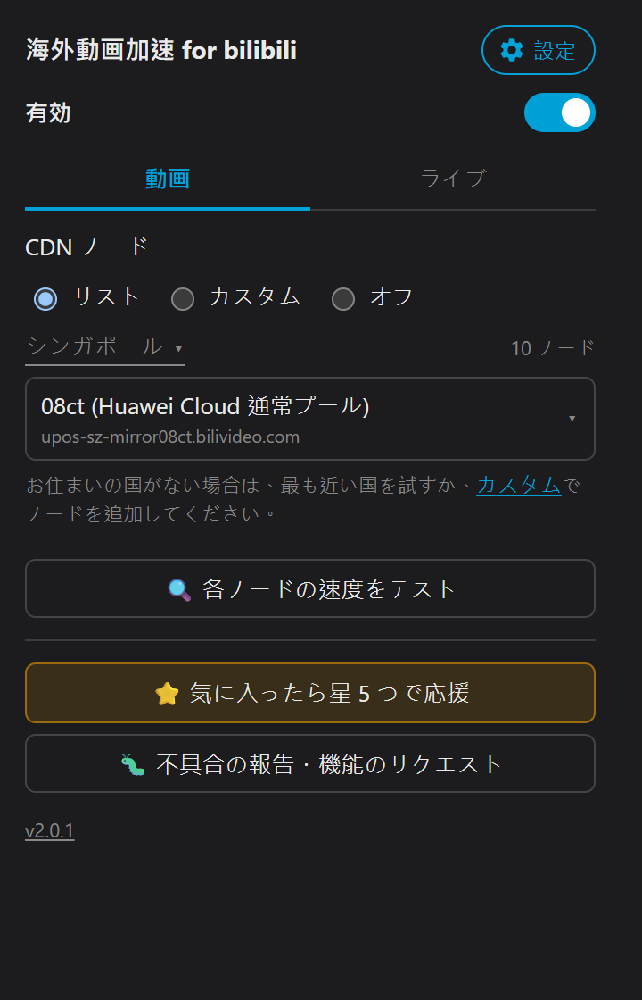

<div align="center">

# 🎬 海外動画加速 for bilibili

**言語 / Language：** [繁體中文](README.zh-TW.md)｜[简体中文](README.zh-CN.md)｜[English](../README.md)｜日本語（このページ）｜[한국어](README.ko.md)

### 海外から Web 版 bilibili をもっとスムーズに見るための Chrome / Firefox / Edge / Safari 拡張機能

### 📥 [Chrome Web Store](https://chromewebstore.google.com/detail/dfaddcffoondcendifiljhdbdagebgch?utm_source=github&utm_medium=referral&utm_campaign=readme&utm_content=ja) ｜ [Firefox Add-ons](https://addons.mozilla.org/addon/bilibili-cdn-switcher?utm_source=github&utm_medium=referral&utm_campaign=readme&utm_content=ja) ｜ [Edge Add-ons](https://microsoftedge.microsoft.com/addons/detail/dllallgilijcacpdemjafegibdafcbdp?utm_source=github&utm_medium=referral&utm_campaign=readme&utm_content=ja) ｜ Safari（App Store、近日公開）

</div>

---

<div align="center">



</div>

---

使用前（拡張機能オフ）


使用後（拡張機能オン）


## ✨ この拡張機能でできること

**🎯 海外（中国本土以外）から Web 版 bilibili（www.bilibili.com）をスムーズに見るための拡張機能です。**

bilibili が標準で割り当てる CDN は、海外ユーザーにとって遠回りで遅い経路になりがちです。この拡張機能は、**動画を取得する CDN を、お住まいの地域で実測して速かったノードに切り替え**、バッファリングや読み込み時間を減らします。

| 機能 | 説明 |
|:--|:--|
| 🚀 **地域ごとの最速ノード** | お住まいの国で実測して最速だった CDN を既定で使用（台湾／シンガポールで実測済み、ほかの国も順次追加中）。インストールするだけで使えます |
| 🌐 **ほかの CDN ノード** | Alibaba Cloud／Tencent Cloud／Huawei Cloud／Akamai／各種海外ノード…… 地域に合わせて自由に切り替え可能 |
| ✏️ **カスタムノードリスト** | 「リスト」と排他の別モード。CDN ホストをいくつでも追加でき、速度テストと並べ替えにも対応。公式ツール **CDNSpeedTest**（Windows）で見つけたおすすめノードもここに自動で追加されます |
| 🛑 **オフ** | 動画とライブにそれぞれ「オフ」があり、CDN の選択に介入せず bilibili 本来の動作のままにします |
| 📺 **ライブ配信に対応** | 「ライブ」タブで国際回線(ov)／国際予備回線(ov-b)／中国回線(cn)／中国予備回線(cn-b) をページを再読み込みせずに切り替えられます。具体的な回線 URL はライブ配信ページで再生が始まってから表示され、現在の配信にない回線にはその旨が表示されてグレーになります（選択は可能）。ライブ回線が不調なときは「失敗時に自動切り替え」がその配信だけ国際回線(ov) に戻し、普段の設定は変更しません |
| 🔁 **自動フェイルオーバー** | セグメントのリクエスト失敗や本当の再生停止（バッファが満杯なだけの状態は除く）を検出すると、まず bilibili 標準のバックアップノードへ自動で切り替え（トースト通知のみ、ページ全体の再読み込みなし）。それでも失敗した場合は、バックアップ URL に切り替えるかどうかを常駐のメッセージで確認します。ポップアップの「失敗時に自動切り替え」でオフにできます（既定はオン）。ご自身のネットワークが不安定な場合はオフをおすすめします |
| 📶 **ノード別速度テスト** | 専用ページ（動画用・ライブ用）で動画タイトルと画質を表示し、現在の動画・画質のセグメントを使って各ノードのダウンロード速度を 1 つずつ計測します。途中でも再テスト可能。**読み取り専用で、選択中の CDN は変更しません**。ページを離れるとすぐにテストを止めます |
| 🌏 **多言語 UI** | ブラウザの言語に合わせて繁体字中国語／簡体字中国語／英語／日本語／韓国語を自動表示（設定で選ぶことも可能）。ポップアップ、ページ内のトースト、デバッグ表示のすべてに対応 |
| 🐛 **デバッグ表示** | 現在使われている CDN ノードを表示（既定はオフ。歯車アイコンの詳細設定でオンにできます） |
| 🦊 **Chrome / Firefox / Edge / Safari** | ソースは `src/` の 1 つだけ。パッケージ化でブラウザごとの zip を出力（Edge は Chromium ベースなので Chrome の manifest をそのまま使用）。Safari は Xcode で `.app` にパッケージ化します（下の「Safari のパッケージ化」を参照） |

---

## 🗂️ プロジェクト構成

```text
bilibili-cdn-switcher/
├── src/                  ← 拡張機能のソース（「パッケージ化されていない拡張機能を読み込む」／パッケージ化の対象）
│   ├── manifest.json          ← Chrome / Edge
│   ├── manifest.firefox.json  ← Firefox（browser_specific_settings 入り）
│   ├── popup.html / popup.js
│   ├── main-hook.js      ← MAIN world：ストリーム URL を書き換え
│   ├── bridge.js         ← ISOLATED world：storage / i18n をページに橋渡し
│   ├── cdn-list.json     ← CDN ノード一覧
│   ├── _locales/{zh_TW,zh_CN,en,ja,ko}/  ← 5 言語の UI 文言（manifest は __MSG_x__、popup.js / main-hook.js は実行時に参照）
│   └── icons/            ← 16 / 32 / 48 / 128
├── dist/                 ← パッケージ化の出力（Chrome/Firefox/Edge は .zip、Safari は .app）
├── docs/                 ← README 用の画像 + 各言語の README
├── assets/               ← 512px アイコンの原本（icons-prod は gen-icons.mjs が生成）
├── store/                ← ストア掲載用スクリーンショット／プロモ画像 + 5 言語のプラットフォーム別紹介文
├── safari/               ← Safari 拡張機能の Xcode プロジェクト（safari-web-extension-converter で生成。相対パスで ../../../src/ を参照）
├── scripts/              ← 開発／ビルド用スクリプト。すべて純粋な Node で、Windows / Mac / Linux で動作
│   ├── build.mjs                 ← ストア提出用 zip をパッケージ化（Chrome + Firefox + Edge）
│   ├── build-safari.mjs          ← Xcode で Safari 拡張機能を .app にパッケージ化（macOS 専用）
│   ├── gen-icons.mjs             ← アイコンを再生成
│   └── capture-screenshots.mjs   ← ブラウザを自動操作してストア用スクリーンショットを撮影（下記参照）
├── package.json           ← scripts/*.mjs が使う Node の依存（jszip / puppeteer / sharp）
├── .env.local.example     ← スクリーンショット用ログイン cookie のサンプル（.env.local にコピーして使用）
└── README.md
```

`scripts/` 以下はすべて純粋な Node（zip は [jszip](https://npm.im/jszip)、画像処理は
[sharp](https://npm.im/sharp)）で、Windows 専用の PowerShell や System.Drawing には依存しないため、
Mac でも同じように動きます。最初に一度 `npm install` で依存を入れるだけです。

### 📦 パッケージ化（Chrome Web Store / Firefox Add-ons / Microsoft Edge Add-ons 提出用）

コンパイルやトランスパイルの工程はなく、`src/` はそのまま「パッケージ化されていない拡張機能を読み込む」で使える
ソースです。「パッケージ化」はストア提出用に zip にまとめるだけで、**自動化はしていません**（push 時に実行されるなどの
仕組みはありません）。`dist/` を更新したいときに手動で実行してください：

```bash
npm install                          # 初回、または node_modules を消したあと
npm run build                        # 既定：Chrome + Firefox + Edge をパッケージ化
npm run build -- --browser=chrome     # Chrome のみ
npm run build -- --browser=firefox    # Firefox のみ
npm run build -- --browser=edge       # Edge のみ
```

Chrome と Edge は `src/manifest.json` を共用し（Edge は Chromium ベースで Chrome の Manifest V3 と完全互換のため、
専用の manifest は不要）、Firefox は `src/manifest.firefox.json` を使います。スクリプトは対応する manifest から
`version` を読み、**`src/` の中身**（選んだ manifest を zip 直下の `manifest.json` に改名）を
`dist/bilibili-cdn-switcher-<browser>-<version>.zip` にまとめます。Chrome と Firefox の manifest の `version` は
そろえておく必要があり、ずれているとスクリプトが警告します（Edge は Chrome の manifest を使うので常に一致します）。

ビルドは再現可能です。`src/` が変わっていなければ、同じブラウザ向けのパッケージ化は毎回バイト単位で同一の zip を
出力します（Windows と Mac の間でも同じ）。将来 CI に組み込んだときも、`dist/` を更新する必要があるかどうかを判断しやすくなります。

### 🍎 Safari のパッケージ化（App Store 提出用）

Safari の拡張機能は Chrome のように zip から直接読み込めず、ホストアプリ（macOS は `.app`、iOS は `.ipa`）に
包んで App Store で配布する必要があります。`safari/` フォルダは `xcrun safari-web-extension-converter` で
生成した Xcode プロジェクトで、相対パス（`../../../src/`）でリポジトリの `src/` を直接参照しているため、
**`src/` を編集してもファイルを同期する必要はなく**、パッケージ化し直すだけで最新の内容が入ります。
リポジトリ全体を clone すればどの Mac でもビルドできます（プロジェクトに絶対パスは含まれていません）。

**必要なもの**：Xcode 本体をインストールした Mac（Command Line Tools だけでは不十分）。

```bash
npm run build:safari                       # macOS、Release、ad-hoc 署名 → dist/
npm run build:safari -- --platform=ios     # iOS 向けにビルド
npm run build:safari -- --configuration=Debug
```

スクリプトは `xcodebuild` を呼び出し、`src/manifest.json` の `version` で `MARKETING_VERSION` を上書きします
（`.app` 内部のバージョンを拡張機能と一致させるため。Xcode プロジェクトの既定値は 1.0 固定）。出力は次の 2 つです：

- `dist/Bilibili CDN Switcher (<platform>).app` —— ダブルクリックでインストール／テストできるアプリ
- `dist/bilibili-cdn-switcher-safari-<platform>-<version>.zip` —— ほかのプラットフォームと同じ
  `bilibili-cdn-switcher-<platform>-<version>` の命名規則で、別のマシンに渡すとき用

⚠️ これは **ad-hoc 署名で、ローカルテスト専用**です。実際の App Store 提出は Xcode で行います：
`safari/` 以下のプロジェクトを開く → Product > Archive > Distribute App で、Apple Developer アカウントで署名します
（署名情報が必要なため、コマンドラインだけでは完結しません）。

### 🎨 アイコンの再生成

```bash
npm run gen-icons
```

512px の原本を 16/32/48/128 に縮小し、2 セットを出力します：`src/icons/`（開発版。赤いバッジの点付きで、
「パッケージ化されていない拡張機能を読み込む」で普段読み込まれるもの。ストアからインストールした版と見分けやすくするため）と
`assets/icons-prod/`（ストア版、バッジなし）。`scripts/build.mjs` は zip をパッケージ化するときに自動で
`assets/icons-prod/` のアイコンに差し替えます。

### 📸 ストア用スクリーンショットの生成（5 画面 × 5 言語、計 25 枚、1280x800 png）

```bash
npm run capture-screenshots                      # 既定 1280x800（Chrome ストアはこのサイズちょうどが必須）
npm run capture-screenshots -- --size=2560x1600  # Mac App Store 用の高解像度版。ファイル名にサイズが入るので別セットとして保存（1280x800 は上書きしない）
```

Puppeteer で `src/` をパッケージ化されていない拡張機能として読み込み、ブラウザの言語を `en-US` / `zh-CN` / `zh-TW` / `ja` / `ko` に
切り替えながら、実際の bilibili の動画ページを開きます（URL は `scripts/capture-screenshots.mjs` 冒頭の `VIDEO_URL`。
動画を変えたいときはその行を編集）。言語ごとに 5 画面 —— 動画メイン、ライブメイン、動画の速度テスト（テスト途中）、
詳細設定、ページ上のデバッグ表示 —— を撮影し、それぞれ黒帯で 1280x800 に収めて `store/` に書き出し、
対応する `screenshot-<言語>-<NN>-<画面>-1280x800.png` を上書きします（言語が先頭なので、ファイル名順に並べると
言語ごと・表示順にまとまります）。ライブメインは bilibili のおすすめ一覧から選んだライブ配信を使います
（`.env.local` に `LIVE_ROOM=<ルーム番号>` を書けば固定できます）。bilibili の CDN に対して実際に速度テストを行うため、
1 回の実行に数分かかり、ネットワーク状況にも左右されます。

`--locale=en|zhcn|zhtw|ja|ko` で 1 つの言語だけ実行できます。`docs/` の README 用画像はスクリプトでは生成せず、手動で管理しています。

**ログイン cookie（任意。スクリーンショットの画質を左右します）**：ログインしていないと bilibili は約 480P までしか
配信しないため、スクリーンショットの `qn` も 480P になります。高画質で撮りたい場合は `.env.local.example` を
`.env.local` にコピーし、自分の `BILI_COOKIE` を記入してください（bilibili にログイン → DevTools → Network →
任意のリクエスト → Request Headers → Cookie の行をまるごとコピー）。スクリプトがこれを見つけるとログイン状態で
動画ページを開き、ファイルがなければ従来どおり未ログインで実行します。`.env.local` は gitignore 済みです ——
**中の `SESSDATA` はアカウントの認証情報と同じなので、絶対にコミットしたり人に渡したりしないでください**。

---

## 🎛️ UI の説明

| 項目 | 動作 |
|:--|:--|
| ⚙️ **詳細設定（右上の歯車）** | 「失敗時に自動切り替え」と「ページにデバッグ表示を出す」のスイッチはここにあり、それぞれわかりやすい説明付きです。デバッグ表示をオンにすると、同じ欄に現在のタブのデバッグ情報も表示されます。メインページのタイトルは現在の言語での拡張機能の正式名称で、「⭐ 気に入ったら星 5 つで応援」と「🐛 不具合の報告・機能のリクエスト」はメインページ最下部の 2 つのボタンです |
| 🎞️ **動画／ライブ タブ** | 「有効」の下は「動画」と「ライブ」の 2 つのタブに分かれています。現在のタブがライブ配信ページなら、ポップアップは「ライブ」で開きます |
| 🔘 **有効** | 動画とライブ共通のマスタースイッチで、既定は**オン**。オフにすると bilibili のストリーム取得にはまったく介入しません（デバッグ表示は引き続き現在の CDN を表示します） |
| 📡 **CDN 回線** | 「リスト」／「カスタム」／「オフ」の排他選択。**既定＝リスト**。リストの上で**国**（台湾／シンガポール／すべて）を選ぶと、その国で実測して速かった 10 ノードだけを表示し（研究レポートの順、既定は先頭の 08ct）、最後は「バックアップ URL」です。横には現在の選択肢のノード数が表示されます。「すべて」を選ぶと約 300 ノードすべてを表示します。インストール直後やアップデート後に初めて開いたときは、IP からお住まいの国を自動で選んで「（現在地）」と表示します（bilibili 自身の zone API を使うため、追加の権限は不要）。リストにない国は台湾が既定です。インストール直後のノードはその国の先頭が既定で、国を切り替えるとノードもその国の先頭に変わり、「テスト結果でノードを並べ替え」で並べた順序はクリアされてその国の元の順序に戻ります。「カスタム」に切り替えると複数のノード URL やホストをリストに追加でき（CDNSpeedTest でテストしたノードも自動で追加されます）、同じように速度テストと並べ替えができます。「オフ」は通常の動画にだけ作用し、動画の CDN 選択には介入しません |
| 📺 **ライブ回線** | 「優先する回線」／「オフ」、**既定＝優先する回線、国際回線(ov)**。4 つの回線は、その配信と同じクラスタ番号の `ov` / `ov-b` / `cn` / `cn-b` です（bilibili ライブの署名は同じクラスタ番号の中でしか通用せず、動画のノードはライブには使えません）。記憶されるのは回線の種類で、具体的なホストではありません |
| 📺 **ライブ回線の速度をテスト** | ライブ配信の再生中のみ使えます。まず 4 つの回線が存在するかを確認し（ないものはスキップ）、回線ごとに 2 項目を計測します：**切り替え遅延**（起動時間、3 回の平均。0～800 ms は低／800～1500 ms は中／1500 ms 超は高で、緑／黄／赤で表示）と **継続視聴**（8 秒間ストリームを取得し、完全に追いつけば緑の「優秀」、1 秒以内の遅れなら黄の「普通」、1 秒を超える遅れは赤の「不良」）。テストは視聴中のライブ配信と帯域を取り合います |
| 🔍 **各ノードの速度をテスト** | 専用の速度テストページに切り替わり、現在の動画のタイトルと画質を表示します。現在の動画・画質のセグメントで各ノードのダウンロード速度を計測し（8MB か 5 秒のどちらか先に達した時点で終了。5 秒以内にまったくデータが来なかった場合だけタイムアウト扱いで、8MB 未満の途中結果はそのまま表示）、現在の国のノードだけをテストして、各行を「待機中／テスト中／結果」で表示します。上位 3 つには右上に金・銀・銅の王冠が付きます。「すべて」を選んでいるときは、先に赤字の警告と所要時間の目安（ノード数 × ノードごとの秒数上限）を表示し、国を選ぶよう促します。「🔄 再テスト」でやり直せます（テスト中でも可能で、今のテストを中断して最初からやり直します）。**読み取り専用で、選択中の CDN は変更しません**。「← 戻る」を押すかポップアップを閉じると、すぐにテストを止めます。「有効」がオンなら playurl を解析した時点でテストでき、実際の再生を待つ必要はありません。オフの場合は、実際にセグメントをダウンロードしたあとでないとサンプルがありません |
| 🔁 **CDN の自動フェイルオーバー** | 既定はオンで、詳細設定でオフにできます（Wi-Fi が弱いなど、ご自身のネットワークが不安定な場合は、何度も黒い画面になるのを避けるためオフをおすすめします）。オンのときは、セグメントのリクエスト失敗（403/404/5xx/ネットワークエラー）や本当の再生停止（8 秒間進まず、通信もない）を検出すると、まず bilibili 標準のバックアップノードへ自動で切り替えます（セグメント単位で差し替えるのでページ全体の再読み込みはなく、トーストで通知）。それでも再生できない場合は、「再読み込みしてバックアップ URL に切り替え」るかどうかを常駐のメッセージで確認します。ライブ配信では、まず選んだ回線がその配信に存在するかを確認し（なければすぐ国際回線 ov に戻す）、しばらくデータが届かない場合も ov に戻します |
| ⚡ **動画を自動テストして最速ノードに切り替え** | 詳細設定にあり、既定は**オフ**。動画はまず選択中のノードで再生し、最初のセグメントをダウンロードしてから約 5 秒後に、現在の国のノードをバックグラウンドで 1 つずつテストして（速度テストの上限を使用）、最速のものをノードとして保存します（動画ごとに 1 回だけテスト）。国が「すべて」のときは使えません。テストのたびに順位が変わるため、ほぼ毎回 CDN の切り替えで一度黒い画面になります。普段からスムーズに再生できているならおすすめしません。カクつきが心配なら「失敗時に自動切り替え」を使ってください |
| 🌏 **言語** | 既定ではブラウザ／OS の言語に合わせて繁体字中国語／簡体字中国語／英語／日本語／韓国語を自動表示します（それ以外の言語は英語）。言語を固定したい場合は、ポップアップの 設定 → 言語 で選んでください |
| 🎨 **テーマ** | ポップアップの 設定 → テーマ で「システムに合わせる」（既定。OS のライト／ダーク設定に従う）／ライト／ダーク を選べます。ライトは薄いグレーの背景に白いカードと bilibili ピンクで、速度テストツール CDNSpeedTest と同じスタイル。ダークは従来のダークデザインです |
| ⏱️ **速度テストの上限** | 詳細設定にあり、動画とライブに分かれています：動画＝ノードごとの最大ダウンロード量／最大時間（既定 8MB / 5 秒、先に達したほう）、ライブ＝切り替え遅延の計測回数／継続視聴の回線ごとの時間（既定 3 回 / 8 秒）。設定は永続的に保存され、各セクションに「既定に戻す」リンクがあります |
| 🔢 **テスト結果でノードを並べ替え** | 詳細設定にあり、既定は**オフ**。オンにすると、各ノードはテストが終わった時点で速い順の位置へスライドします（動画：ダウンロード速度、ライブ：まず継続視聴のレベル、次に切り替え遅延）。順序はローカルに保存され、次にテストするまでメインページのノード一覧もこの順序になります。オフにすると既定の順序に戻ります |
| 🐛 **ページにデバッグ表示を出す** | 詳細設定にあり、既定は**オフ**。回線切り替えのスイッチとは独立していて、切り替えを無効にしていても現在の CDN を表示するので、比較に便利です |

<details>
<summary>🔍 <b>デバッグ表示の見た目</b>（プレーヤーの左上）</summary>

```text
mode=on  target=upos-sz-mirror08ct.bilivideo.com
cdn=<現在実際に配信しているホスト>
v=<使用中の動画ホスト>  a=<使用中の音声ホスト>
src=playinfo|playurl  rw=<書き換え回数>  seg=<セグメント差し替え回数>  qn=<画質>
```

</details>

---

## 🗂️ 設定ファイル

- 📋 ノード一覧は **`src/cdn-list.json`** にあり、手動で編集します。
  300 以上の動画ノード（重複を除き、ライブ専用ノードと停止が確認されたノードを削除済み）を収録しています。
  各国の `nodes` は、CDN プールが偏らないように選んだ上位 10 ノードです。`/cdn-speedtest` で新しい国をテストしたら、`summary.json` のその国の `recommended` を `countries` に追加してください。
- 🧩 フォーマット：

  ```json
  {
    "countries": [{ "code": "TW", "dial": 886, "name": { "zh_TW": "台灣", "zh_CN": "台湾", "en": "Taiwan" }, "nodes": ["upos-sz-mirror08ct.bilivideo.com", "…"] }],
    "pools": { "hw-biliv6": { "zh_TW": "華為雲 一般池", "zh_CN": "华为云 常规池", "en": "Huawei Cloud" } },
    "options": [{ "value": "upos-sz-mirror08ct.bilivideo.com", "name": "08ct", "pool": "hw-biliv6" }]
  }
  ```

  `options` はすべてのノード（「すべて」を選んだときの順序でもあります）で、「コード（プールの種類）」の形で表示されます。`countries[].nodes` の先頭がその国の既定値です。`dial` は国際電話の国番号で、bilibili の zone API が返す `country_code` との照合に使います。
  特別な `value`：🔁 `backup` = バックアップ URL を優先（常に最後。言語ファイルの `nameKey` / `noteKey` を使用）。「オフ」と「カスタム」はポップアップの別モードで、この一覧には含まれません。

---

## ⚠️ 注意事項

- 🔒 元のホストは常に `backupUrl` として残してあるため、ホストに紐づいた URL が 1 つ失敗しても、セグメント全体が取れなくなることはありません。
- 📍 既定のノードは台湾とシンガポールで実測済みで、ほかの国も順次追加中です。それ以外の地域の方は、近いノードに切り替えるか、「カスタムノードリスト」で自分のホストを追加してください（CDNSpeedTest ツールで探せます）。
- 📶 「各ノードの速度をテスト」は 1 セグメントだけの短時間の計測なので、結果は参考程度にしてください。CDN がその動画・画質をすでにキャッシュしているか、時間帯による回線の混雑具合などが、実際の視聴体験に影響します。テストで最速だったノードが、長時間の視聴でも最もスムーズとは限りません。

---

## 📜 ライセンス

独自の **[Source-Available License](../LICENSE)** でソースを公開しています：

- ✅ ソースの閲覧、fork、改変が可能で、個人利用、教育・研究などの非商用利用は自由です
- ❌ 本プロジェクトや改変版を、競合するブラウザ拡張機能／アプリ／サービスとして再パッケージ化して公開すること、著作権表示を削除することはできません
- 詳しい条文は [LICENSE](../LICENSE) を参照してください。商用での協業や例外の許諾については issue でご相談ください

プライバシーポリシー：[PRIVACY.md](../PRIVACY.md)

---

<div align="center">

Made with ❤️ for 🇹🇼 / 🇸🇬 bilibili viewers · Inspired by [@roge4444](https://github.com/roge4444)'s [PiliNaraRogerMod](https://github.com/roge4444/PiliNaraRogerMod) / [blblRogerMod](https://github.com/roge4444/blblRogerMod)

</div>
