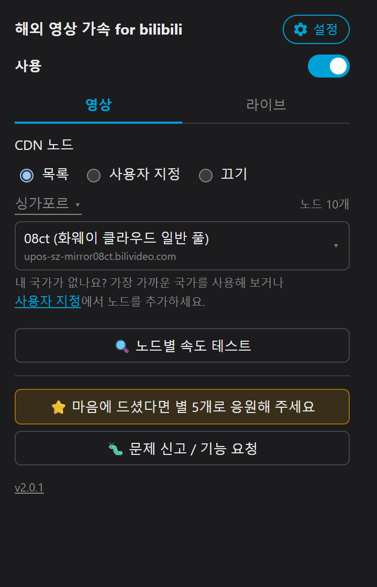
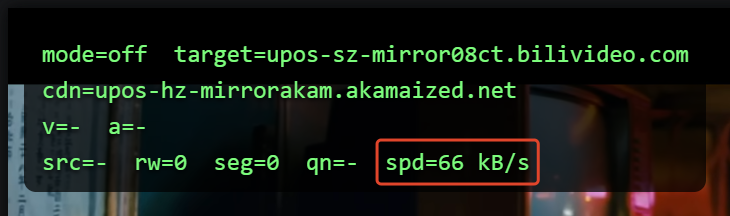
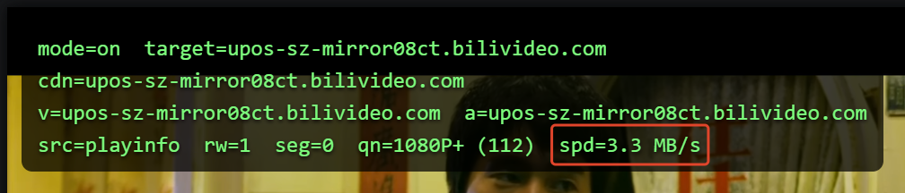

<div align="center">

# 🎬 해외 영상 가속 for bilibili

**언어 / Language：** [繁體中文](README.zh-TW.md)｜[简体中文](README.zh-CN.md)｜[English](../README.md)｜[日本語](README.ja.md)｜한국어(이 페이지)

### 해외에서 웹 bilibili를 더 매끄럽게 보기 위한 Chrome / Firefox / Edge / Safari 확장 프로그램

### 📥 [Chrome Web Store](https://chromewebstore.google.com/detail/dfaddcffoondcendifiljhdbdagebgch?utm_source=github&utm_medium=referral&utm_campaign=readme&utm_content=ko) ｜ [Firefox Add-ons](https://addons.mozilla.org/addon/bilibili-cdn-switcher?utm_source=github&utm_medium=referral&utm_campaign=readme&utm_content=ko) ｜ [Edge Add-ons](https://microsoftedge.microsoft.com/addons/detail/dllallgilijcacpdemjafegibdafcbdp?utm_source=github&utm_medium=referral&utm_campaign=readme&utm_content=ko) ｜ Safari(App Store, 출시 예정)

</div>

---

<div align="center">



</div>

---

사용 전(확장 프로그램 끔)



사용 후(확장 프로그램 켬)



## ✨ 이 확장 프로그램이 하는 일

**🎯 해외(중국 본토 외) 사용자가 웹 bilibili(www.bilibili.com)를 더 매끄럽게 볼 수 있도록 만든 확장 프로그램입니다.**

bilibili가 기본으로 배정하는 CDN은 해외 사용자에게 느리고 돌아가는 경로가 되는 경우가 많습니다. 이 확장 프로그램은 **영상을 가져오는 CDN을 사용자 지역에서 실측해 더 빨랐던 노드로 바꿔** 버퍼링과 로딩 시간을 줄여 줍니다.

| 기능 | 설명 |
|:--|:--|
| 🚀 **지역별 최적 노드** | 사용자 국가에서 실측해 가장 빨랐던 CDN을 기본으로 사용(대만/싱가포르에서 실측 완료, 다른 국가도 순차 추가 중). 설치하면 바로 사용할 수 있습니다 |
| 🌐 **다른 CDN 노드** | Alibaba Cloud / Tencent Cloud / Huawei Cloud / Akamai / 각종 해외 노드… 지역에 맞게 자유롭게 전환 가능 |
| ✏️ **사용자 지정 노드 목록** | 「목록」과 상호 배타적인 별도 모드. CDN 호스트를 원하는 만큼 추가할 수 있고 속도 테스트와 정렬도 지원합니다. 공식 도구 **CDNSpeedTest**(Windows)가 찾은 추천 노드도 여기에 자동으로 추가됩니다 |
| 🛑 **끄기** | 영상과 라이브에 각각 「끄기」가 있으며, CDN 선택에 개입하지 않고 bilibili 원래 동작을 그대로 유지합니다 |
| 📺 **라이브 방송 지원** | 「라이브」 탭에서 국제 회선(ov) / 국제 예비 회선(ov-b) / 중국 회선(cn) / 중국 예비 회선(cn-b)을 페이지 새로고침 없이 전환할 수 있습니다. 실제 회선 URL은 라이브 방송 페이지에서 재생이 시작된 뒤에 표시되며, 현재 방송에 없는 회선은 그렇다고 표시되고 흐리게 나타납니다(선택은 가능). 라이브 회선 상태가 나쁘면 「실패 시 자동 전환」이 해당 방송만 국제 회선(ov)으로 되돌리며, 평소 설정은 바꾸지 않습니다 |
| 🔁 **자동 장애 조치** | 세그먼트 요청 실패나 실제 재생 멈춤(버퍼가 가득 찬 상태는 제외)을 감지하면, 먼저 bilibili 자체 백업 노드로 조용히 전환합니다(토스트 알림만 표시, 페이지 전체 새로고침 없음). 백업도 실패하면 백업 URL로 전환할지 상시 메시지로 묻습니다. 팝업의 「실패 시 자동 전환」으로 끌 수 있으며(기본값은 켬), 사용자 네트워크가 불안정하다면 끄는 것을 권장합니다 |
| 📶 **노드별 속도 테스트** | 전용 페이지(영상용, 라이브용)에서 영상 제목과 화질을 보여 주고, 현재 영상·화질의 세그먼트로 각 노드의 다운로드 속도를 하나씩 측정합니다. 테스트 도중에도 다시 테스트할 수 있습니다. **읽기 전용이며 선택한 CDN은 바꾸지 않습니다**. 페이지를 벗어나면 바로 테스트를 멈춥니다 |
| 🌏 **다국어 UI** | 브라우저 언어에 맞춰 번체 중국어 / 간체 중국어 / 영어 / 일본어 / 한국어를 자동으로 표시합니다(설정에서 직접 선택도 가능). 팝업, 페이지 내 토스트, 디버그 오버레이 모두 지원합니다 |
| 🐛 **디버그 오버레이** | 현재 사용 중인 CDN 노드를 표시합니다(기본값은 끔. 톱니바퀴 아이콘의 고급 설정에서 켤 수 있습니다) |
| 🦊 **Chrome / Firefox / Edge / Safari** | 소스는 `src/` 하나뿐이며, 패키징하면 브라우저별 zip이 나옵니다(Edge는 Chromium 기반이라 Chrome의 manifest를 그대로 사용). Safari는 Xcode로 `.app`으로 패키징합니다(아래 「Safari 패키징」 참고) |

---

## 🗂️ 프로젝트 구조

```text
bilibili-cdn-switcher/
├── src/                  ← 확장 프로그램 소스(「압축해제된 확장 프로그램을 로드」/ 패키징 대상)
│   ├── manifest.json          ← Chrome / Edge
│   ├── manifest.firefox.json  ← Firefox(browser_specific_settings 포함)
│   ├── popup.html / popup.js
│   ├── main-hook.js      ← MAIN world: 스트림 URL 재작성
│   ├── bridge.js         ← ISOLATED world: storage / i18n을 페이지로 전달
│   ├── cdn-list.json     ← CDN 노드 목록
│   ├── _locales/{zh_TW,zh_CN,en,ja,ko}/  ← 5개 언어 UI 문구(manifest는 __MSG_x__, popup.js / main-hook.js는 실행 중에 조회)
│   └── icons/            ← 16 / 32 / 48 / 128
├── dist/                 ← 패키징 결과물(Chrome/Firefox/Edge는 .zip, Safari는 .app)
├── docs/                 ← README용 이미지 + 각 언어 README
├── assets/               ← 512px 아이콘 원본(icons-prod는 gen-icons.mjs가 생성)
├── store/                ← 스토어 등록용 스크린샷 / 홍보 이미지 + 5개 언어 플랫폼별 소개문
├── safari/               ← Safari 확장 프로그램 Xcode 프로젝트(safari-web-extension-converter로 생성, 상대 경로로 ../../../src/ 참조)
├── scripts/              ← 개발/빌드 스크립트. 모두 순수 Node로 Windows / Mac / Linux에서 동작
│   ├── build.mjs                 ← 스토어 제출용 zip 패키징(Chrome + Firefox + Edge)
│   ├── build-safari.mjs          ← Xcode로 Safari 확장 프로그램을 .app으로 패키징(macOS 전용)
│   ├── gen-icons.mjs             ← 아이콘 재생성
│   └── capture-screenshots.mjs   ← 브라우저를 자동 조작해 스토어 스크린샷 촬영(아래 참고)
├── package.json           ← scripts/*.mjs가 쓰는 Node 의존성(jszip / puppeteer / sharp)
├── .env.local.example     ← 스크린샷용 로그인 cookie 예시(.env.local로 복사해서 사용)
└── README.md
```

`scripts/` 아래는 모두 순수 Node(zip은 [jszip](https://npm.im/jszip), 이미지 처리는
[sharp](https://npm.im/sharp))로, Windows 전용 PowerShell이나 System.Drawing에 의존하지 않아
Mac에서도 똑같이 동작합니다. 처음 한 번 `npm install`로 의존성만 설치하면 됩니다.

### 📦 패키징(Chrome Web Store / Firefox Add-ons / Microsoft Edge Add-ons 제출용)

컴파일이나 트랜스파일 단계는 없으며, `src/`는 그대로 「압축해제된 확장 프로그램을 로드」로 쓸 수 있는 소스입니다.
「패키징」은 스토어 제출용으로 zip으로 묶는 것뿐이고, **자동화는 되어 있지 않습니다**(push 시 실행되는 등의
장치는 없음). `dist/`를 갱신해야 할 때 직접 실행하세요:

```bash
npm install                          # 처음 실행할 때, 또는 node_modules를 지운 뒤
npm run build                        # 기본값: Chrome + Firefox + Edge 패키징
npm run build -- --browser=chrome     # Chrome만
npm run build -- --browser=firefox    # Firefox만
npm run build -- --browser=edge       # Edge만
```

Chrome과 Edge는 `src/manifest.json`을 함께 쓰고(Edge는 Chromium 기반으로 Chrome의 Manifest V3와 완전히 호환되므로
별도 manifest가 필요 없음), Firefox는 `src/manifest.firefox.json`을 씁니다. 스크립트는 해당 manifest에서
`version`을 읽어 **`src/`의 내용**(선택한 manifest를 zip 최상위의 `manifest.json`으로 이름 변경)을
`dist/bilibili-cdn-switcher-<browser>-<version>.zip`으로 묶습니다. Chrome과 Firefox manifest의 `version`은
항상 같아야 하며, 다르면 스크립트가 경고합니다(Edge는 Chrome의 manifest를 쓰므로 항상 일치합니다).

빌드는 재현 가능합니다. `src/`가 바뀌지 않았다면 같은 브라우저용 패키징은 매번 바이트 단위로 동일한 zip을
만듭니다(Windows와 Mac 사이에서도 동일). 나중에 CI에 연결하더라도 `dist/`를 갱신해야 하는지 판단하기 쉽습니다.

### 🍎 Safari 패키징(App Store 제출용)

Safari 확장 프로그램은 Chrome처럼 zip에서 바로 불러올 수 없고, 호스트 앱(macOS는 `.app`, iOS는 `.ipa`)으로
감싸 App Store로 배포해야 합니다. `safari/` 폴더는 `xcrun safari-web-extension-converter`로 생성한
Xcode 프로젝트로, 상대 경로(`../../../src/`)로 저장소의 `src/`를 직접 참조하므로
**`src/`를 수정해도 파일을 동기화할 필요가 없고**, 다시 패키징하기만 하면 최신 내용이 들어갑니다.
저장소 전체를 clone하면 어느 Mac에서나 빌드할 수 있습니다(프로젝트에 절대 경로가 없음).

**필요 조건**: Xcode 전체를 설치한 Mac(Command Line Tools만으로는 부족).

```bash
npm run build:safari                       # macOS, Release, ad-hoc 서명 → dist/
npm run build:safari -- --platform=ios     # iOS용으로 빌드
npm run build:safari -- --configuration=Debug
```

스크립트는 `xcodebuild`를 호출하고 `src/manifest.json`의 `version`으로 `MARKETING_VERSION`을 덮어씁니다
(`.app` 내부 버전을 확장 프로그램과 맞추기 위해서이며, Xcode 프로젝트 기본값은 1.0 고정). 결과물은 두 가지입니다:

- `dist/Bilibili CDN Switcher (<platform>).app` —— 더블클릭으로 설치/테스트할 수 있는 앱
- `dist/bilibili-cdn-switcher-safari-<platform>-<version>.zip` —— 다른 플랫폼과 같은
  `bilibili-cdn-switcher-<platform>-<version>` 명명 규칙으로, 다른 기기에 넘길 때 사용

⚠️ 이것은 **ad-hoc 서명이며 로컬 테스트 전용**입니다. 실제 App Store 제출은 Xcode에서 합니다:
`safari/` 아래 프로젝트 열기 → Product > Archive > Distribute App에서 Apple Developer 계정으로 서명
(서명 정보가 필요해 명령줄만으로는 끝낼 수 없습니다).

### 🎨 아이콘 재생성

```bash
npm run gen-icons
```

512px 원본을 16/32/48/128로 축소해 두 세트를 만듭니다: `src/icons/`(개발용. 빨간 배지 점이 있으며
「압축해제된 확장 프로그램을 로드」가 평소 읽는 아이콘으로, 스토어에서 설치한 버전과 구분하기 쉽게 하기 위함)와
`assets/icons-prod/`(스토어용, 배지 없음). `scripts/build.mjs`는 zip을 패키징할 때 자동으로
`assets/icons-prod/`의 아이콘으로 바꿔 넣습니다.

### 📸 스토어 스크린샷 생성(5개 화면 × 5개 언어, 총 25장, 1280x800 png)

```bash
npm run capture-screenshots                      # 기본 1280x800(Chrome 스토어는 정확히 이 크기여야 함)
npm run capture-screenshots -- --size=2560x1600  # Mac App Store용 고해상도. 파일 이름에 크기가 들어가므로 별도 세트로 저장(1280x800을 덮어쓰지 않음)
```

Puppeteer로 `src/`를 압축해제된 확장 프로그램으로 불러온 뒤, 브라우저 언어를 `en-US` / `zh-CN` / `zh-TW` / `ja` / `ko`로
바꿔 가며 실제 bilibili 영상 페이지를 엽니다(URL은 `scripts/capture-screenshots.mjs` 맨 위의 `VIDEO_URL`.
영상을 바꾸려면 그 줄을 수정). 언어마다 5개 화면 —— 영상 메인, 라이브 메인, 영상 속도 테스트(테스트 도중),
고급 설정, 페이지의 디버그 오버레이 —— 를 찍고, 각각 검은 여백을 넣어 1280x800으로 맞춘 뒤 `store/`에 저장해
해당 `screenshot-<언어>-<NN>-<화면>-1280x800.png`를 덮어씁니다(언어가 앞에 오므로 파일 이름순으로 정렬하면
언어별, 표시 순서대로 모입니다). 라이브 메인은 bilibili 추천 목록에서 고른 라이브 방송을 사용합니다
(`.env.local`에 `LIVE_ROOM=<방 번호>`를 지정하면 고정). bilibili CDN에 실제로 속도 테스트를 하므로
한 번 실행에 몇 분이 걸리고 네트워크 상황에 따라 달라집니다.

`--locale=en|zhcn|zhtw|ja|ko`로 한 언어만 실행할 수 있습니다. `docs/`의 README용 이미지는 스크립트로 만들지 않고 직접 관리합니다.

**로그인 cookie(선택 사항, 스크린샷 화질을 좌우함)**: 로그인하지 않으면 bilibili는 약 480P까지만
제공하므로 스크린샷의 `qn`도 480P가 됩니다. 고화질로 찍으려면 `.env.local.example`을 `.env.local`로
복사하고 본인의 `BILI_COOKIE`를 채우세요(bilibili 로그인 → DevTools → Network → 아무 요청 →
Request Headers → Cookie 줄 전체 복사). 스크립트가 이를 찾으면 로그인 상태로 영상 페이지를 열고,
파일이 없으면 기존처럼 비로그인 상태로 실행합니다. `.env.local`은 gitignore되어 있습니다 ——
**안의 `SESSDATA`는 계정 자격 증명과 같으므로 절대 커밋하거나 다른 사람에게 공유하지 마세요**.

---

## 🎛️ UI 설명

| 항목 | 동작 |
|:--|:--|
| ⚙️ **고급 설정(오른쪽 위 톱니바퀴)** | 「실패 시 자동 전환」과 「페이지에 디버그 오버레이 표시」 스위치가 여기 있으며, 각각 알기 쉬운 설명이 붙어 있습니다. 디버그 오버레이를 켜면 같은 영역에 현재 탭의 디버그 정보도 표시됩니다. 메인 페이지 제목은 현재 언어로 된 확장 프로그램의 정식 이름이고, 「⭐ 마음에 드셨다면 별 5개로 응원해 주세요」와 「🐛 문제 신고 / 기능 요청」은 메인 페이지 맨 아래의 두 버튼입니다 |
| 🎞️ **영상 / 라이브 탭** | 「사용」 아래는 「영상」과 「라이브」 두 탭으로 나뉩니다. 현재 탭이 라이브 방송 페이지라면 팝업은 「라이브」로 열립니다 |
| 🔘 **사용** | 영상과 라이브 공통의 마스터 스위치로 기본값은 **켬**. 끄면 bilibili의 스트림 가져오기에 전혀 개입하지 않습니다(디버그 오버레이는 여전히 현재 CDN을 표시합니다) |
| 📡 **CDN 회선** | 「목록」/「사용자 지정」/「끄기」 중 하나를 선택. **기본값＝목록**. 목록 위에서 **국가**(대만/싱가포르/전체)를 고르면 그 국가에서 실측해 빨랐던 노드 10개만 표시하며(연구 보고서 순서, 기본값은 첫 항목 08ct), 마지막 항목은 「백업 URL」입니다. 옆에는 현재 선택의 노드 수가 표시됩니다. 「전체」를 고르면 약 300개 노드를 모두 표시합니다. 설치 직후나 업데이트 후 처음 열면 IP로 사용자 국가를 자동으로 고르고 「(현재 위치)」로 표시합니다(bilibili 자체 zone API를 사용하므로 추가 권한 불필요). 목록에 없는 국가는 대만이 기본값입니다. 설치 직후 노드는 그 국가의 첫 항목이 기본값이며, 국가를 바꾸면 노드도 그 국가의 첫 항목으로 바뀌고 「속도 테스트 순으로 노드 정렬」로 정한 순서는 지워져 그 국가의 원래 순서로 돌아갑니다. 「사용자 지정」으로 바꾸면 여러 노드 URL이나 호스트를 목록에 추가할 수 있고(CDNSpeedTest로 테스트한 노드도 자동 추가), 똑같이 속도 테스트와 정렬이 가능합니다. 「끄기」는 일반 영상에만 적용되며 영상 CDN 선택에 개입하지 않습니다 |
| 📺 **라이브 회선** | 「선호 회선」/「끄기」, **기본값＝선호 회선, 국제 회선(ov)**. 네 회선은 해당 방송과 같은 클러스터 번호의 `ov` / `ov-b` / `cn` / `cn-b`입니다(bilibili 라이브 서명은 같은 클러스터 번호 안에서만 유효하며, 영상 노드는 라이브에 쓸 수 없습니다). 기억하는 것은 회선 종류이지 특정 호스트가 아닙니다 |
| 📺 **라이브 회선 속도 테스트** | 라이브 방송이 재생 중일 때만 사용할 수 있습니다. 먼저 네 회선이 있는지 확인하고(없는 회선은 건너뜀), 회선마다 두 가지를 측정합니다: **전환 지연**(시작 시간, 3회 평균. 0～800 ms 낮음 / 800～1500 ms 보통 / 1500 ms 초과 높음, 초록/노랑/빨강으로 표시)과 **연속 시청**(8초 동안 스트림을 받아 완전히 따라가면 초록 「우수」, 1초 이내로 뒤처지면 노랑 「보통」, 1초 넘게 뒤처지면 빨강 「나쁨」). 테스트는 시청 중인 라이브 방송과 대역폭을 나눠 씁니다 |
| 🔍 **노드별 속도 테스트** | 전용 속도 테스트 페이지로 바뀌며 현재 영상의 제목과 화질을 보여 줍니다. 현재 영상·화질의 세그먼트로 각 노드의 다운로드 속도를 측정하고(8MB와 5초 중 먼저 도달하는 쪽에서 종료. 5초 안에 데이터가 전혀 오지 않을 때만 시간 초과로 처리하며, 8MB 미만의 중간 결과는 그대로 표시), 현재 국가의 노드만 테스트해 각 행을 「대기 중 / 테스트 중 / 결과」로 표시합니다. 가장 빠른 세 노드에는 오른쪽 위에 금·은·동 왕관이 붙습니다. 「전체」를 선택한 경우에는 먼저 빨간 경고와 예상 소요 시간(노드 수 × 노드당 초 한도)을 보여 주고 국가를 고르도록 안내합니다. 「🔄 다시 테스트」로 다시 실행할 수 있습니다(테스트 도중에도 가능하며, 현재 테스트를 중단하고 처음부터 다시 시작). **읽기 전용이며 선택한 CDN은 바꾸지 않습니다**. 「← 뒤로」를 누르거나 팝업을 닫으면 바로 테스트를 멈춥니다. 「사용」이 켜져 있으면 playurl을 해석한 시점부터 테스트할 수 있어 실제 재생을 기다릴 필요가 없고, 꺼져 있으면 실제로 세그먼트를 내려받은 뒤에야 샘플이 생깁니다 |
| 🔁 **CDN 자동 장애 조치** | 기본값은 켬이며 고급 설정에서 끌 수 있습니다(Wi-Fi가 약한 등 사용자 네트워크가 불안정하다면 반복되는 검은 화면을 피하기 위해 끄는 것을 권장). 켜져 있으면 세그먼트 요청 실패(403/404/5xx/네트워크 오류)나 실제 재생 멈춤(8초 동안 진행이 없고 통신도 없음)을 감지했을 때 먼저 bilibili 자체 백업 노드로 조용히 전환합니다(세그먼트 단위로 교체하므로 페이지 전체 새로고침 없음, 토스트로 알림). 백업으로도 재생할 수 없으면 「새로고침하고 백업 URL로 전환」할지 상시 메시지로 묻습니다. 라이브 방송에서는 먼저 선택한 회선이 그 방송에 있는지 확인하고(없으면 바로 국제 회선 ov로 되돌림), 한동안 데이터가 오지 않을 때도 ov로 되돌립니다 |
| ⚡ **영상 가장 빠른 노드로 자동 전환** | 고급 설정에 있으며 기본값은 **끔**. 영상은 먼저 선택한 노드로 재생하고, 첫 세그먼트를 내려받고 약 5초 뒤 현재 국가의 노드를 백그라운드에서 하나씩 테스트해(속도 테스트 한도 사용) 가장 빠른 노드를 저장합니다(영상마다 한 번만 테스트). 국가가 「전체」일 때는 사용할 수 없습니다. 테스트할 때마다 순위가 달라지므로 거의 매번 CDN 전환으로 한 번씩 검은 화면이 됩니다. 평소 선택한 노드로 매끄럽게 재생된다면 권장하지 않으며, 끊김이 걱정된다면 「실패 시 자동 전환」을 쓰세요 |
| 🌏 **언어** | 기본적으로 브라우저/OS 언어에 맞춰 번체 중국어 / 간체 중국어 / 영어 / 일본어 / 한국어를 자동으로 표시합니다(그 밖의 언어는 영어). 언어를 고정하려면 팝업의 설정 → 언어에서 고르세요 |
| 🎨 **테마** | 팝업의 설정 → 테마에서 시스템 설정 따름(기본값, OS의 라이트/다크 설정에 따름) / 라이트 / 다크 중에서 고를 수 있습니다. 라이트는 연회색 배경에 흰색 카드와 bilibili 핑크로, 속도 테스트 도구 CDNSpeedTest와 같은 스타일입니다. 다크는 기존 다크 디자인입니다 |
| ⏱️ **속도 테스트 한도** | 고급 설정에 있으며 영상과 라이브로 나뉩니다: 영상＝노드당 최대 다운로드 / 최대 시간(기본 8MB / 5초, 먼저 도달하는 쪽), 라이브＝전환 지연 측정 횟수 / 연속 시청 회선당 시간(기본 3회 / 8초). 설정은 영구 저장되며 각 영역에 「기본값으로」 링크가 있습니다 |
| 🔢 **속도 테스트 순으로 노드 정렬** | 고급 설정에 있으며 기본값은 **끔**. 켜면 각 노드는 테스트가 끝나는 즉시 빠른 순 위치로 미끄러지듯 이동합니다(영상: 다운로드 속도, 라이브: 먼저 연속 시청 등급, 그다음 전환 지연). 순서는 로컬에 저장되어 다음 테스트 전까지 메인 페이지의 노드 목록도 이 순서를 따르며, 끄면 기본 순서로 돌아갑니다 |
| 🐛 **페이지에 디버그 오버레이 표시** | 고급 설정에 있으며 기본값은 **끔**. 회선 전환 스위치와는 독립적이라 전환을 꺼도 현재 CDN을 표시하므로 비교할 때 편리합니다 |

<details>
<summary>🔍 <b>디버그 오버레이 모습</b>(플레이어 왼쪽 위)</summary>

```text
mode=on  target=upos-sz-mirror08ct.bilivideo.com
cdn=<지금 실제로 스트리밍 중인 호스트>
v=<사용 중인 영상 호스트>  a=<사용 중인 오디오 호스트>
src=playinfo|playurl  rw=<재작성 횟수>  seg=<세그먼트 교체 횟수>  qn=<화질>
```

</details>

---

## 🗂️ 설정 파일

- 📋 노드 목록은 **`src/cdn-list.json`**에 있으며 직접 편집합니다.
  300개 이상의 영상 노드(중복 제거, 라이브 전용 노드와 작동하지 않는 것으로 확인된 노드 삭제)를 담고 있습니다.
  각 국가의 `nodes`는 CDN 풀이 한쪽에 몰리지 않도록 고른 상위 10개 노드입니다. `/cdn-speedtest`로 새 국가를 테스트했다면 `summary.json`의 해당 국가 `recommended`를 `countries`에 추가하세요.
- 🧩 형식:

  ```json
  {
    "countries": [{ "code": "TW", "dial": 886, "name": { "zh_TW": "台灣", "zh_CN": "台湾", "en": "Taiwan" }, "nodes": ["upos-sz-mirror08ct.bilivideo.com", "…"] }],
    "pools": { "hw-biliv6": { "zh_TW": "華為雲 一般池", "zh_CN": "华为云 常规池", "en": "Huawei Cloud" } },
    "options": [{ "value": "upos-sz-mirror08ct.bilivideo.com", "name": "08ct", "pool": "hw-biliv6" }]
  }
  ```

  `options`는 모든 노드(「전체」를 골랐을 때의 순서이기도 함)이며 「코드(풀 종류)」 형태로 표시됩니다. `countries[].nodes`의 첫 항목이 그 국가의 기본값입니다. `dial`은 국제 전화 국가 번호로, bilibili zone API가 돌려주는 `country_code`와 대조하는 데 씁니다.
  특수 `value`: 🔁 `backup` = 백업 URL 우선(항상 마지막, 언어 파일의 `nameKey` / `noteKey` 사용). 「끄기」와 「사용자 지정」은 팝업의 별도 모드로 이 목록에 포함되지 않습니다.

---

## ⚠️ 참고 사항

- 🔒 원래 호스트는 항상 `backupUrl`로 남겨 두므로, 호스트에 묶인 URL 하나가 실패해도 세그먼트 전체를 못 받는 일은 없습니다.
- 📍 기본 노드는 대만과 싱가포르에서 실측했으며 다른 국가도 순차 추가 중입니다. 그 밖의 지역 사용자는 가까운 노드로 바꾸거나 「사용자 지정 노드 목록」에 직접 호스트를 추가하세요(CDNSpeedTest 도구로 찾을 수 있습니다).
- 📶 「노드별 속도 테스트」는 세그먼트 하나만 짧게 측정하므로 결과는 참고용으로만 보세요. CDN이 이미 해당 영상·화질을 캐시했는지, 시간대별 회선 혼잡 정도 등이 실제 시청 경험에 영향을 줍니다. 테스트에서 가장 빨랐던 노드가 오래 볼 때도 가장 매끄럽다고는 할 수 없습니다.

---

## 📜 라이선스

자체 **[Source-Available License](../LICENSE)**로 소스를 공개합니다:

- ✅ 소스 열람, fork, 수정이 가능하며 개인 사용, 교육·연구 등 비상업적 용도는 자유롭게 허용됩니다
- ❌ 이 프로젝트나 수정본을 경쟁 브라우저 확장 프로그램/앱/서비스로 다시 패키징해 배포하거나, 저작권 표시를 삭제할 수 없습니다
- 전체 조항은 [LICENSE](../LICENSE)를 참고하세요. 상업적 협업이나 예외 허가는 issue로 문의해 주세요

개인정보 처리방침: [PRIVACY.md](../PRIVACY.md)

---

<div align="center">

Made with ❤️ for 🇹🇼 / 🇸🇬 bilibili viewers · Inspired by [@roge4444](https://github.com/roge4444)'s [PiliNaraRogerMod](https://github.com/roge4444/PiliNaraRogerMod) / [blblRogerMod](https://github.com/roge4444/blblRogerMod)

</div>
