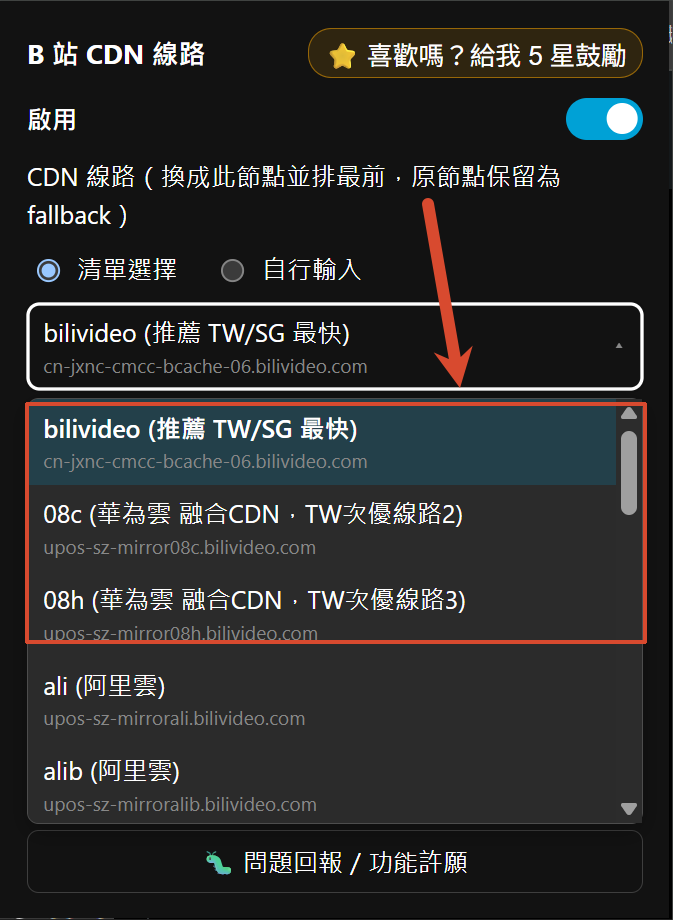
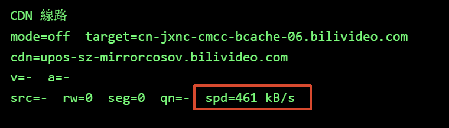
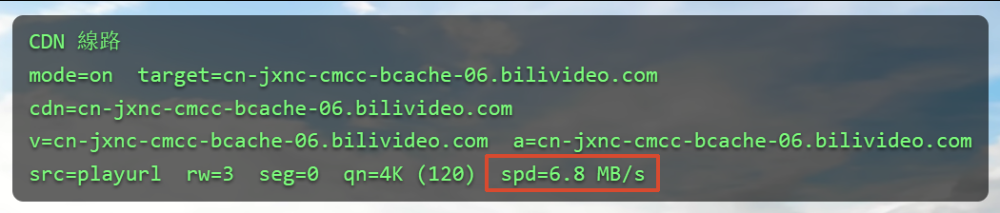

<div align="center">

# 🎬 B 站 CDN 线路重排

**语言 / Language：** [繁體中文](README.zh-TW.md)｜简体中文（本页）｜[English](../README.md)

### 让海外用户看网页版 B 站更顺的 Chrome / Firefox / Edge / Safari 扩充

### 📥 [Chrome Web Store](https://chromewebstore.google.com/detail/dfaddcffoondcendifiljhdbdagebgch?utm_source=github&utm_medium=referral&utm_campaign=readme&utm_content=zhcn) ｜ [Firefox Add-ons](https://addons.mozilla.org/addon/bilibili-cdn-switcher?utm_source=github&utm_medium=referral&utm_campaign=readme&utm_content=zhcn) ｜ [Edge Add-ons](https://microsoftedge.microsoft.com/addons/detail/dllallgilijcacpdemjafegibdafcbdp?utm_source=github&utm_medium=referral&utm_campaign=readme&utm_content=zhcn) ｜ Safari（App Store，即将上架）

</div>

---


---

Before


After


## ✨ 这个扩充在做什么

**🎯 主要是为了让海外（中国大陆以外）的使用者看网页版 B 站（www.bilibili.com）更顺。**

B 站预设分配的取流节点对海外使用者常常绕路、不够快。这个扩充会**把视频的取流 CDN 重排、换成一个对你所在地区实测较快的最优节点**，让缓冲与载入更顺。

| 功能 | 说明 |
|:--|:--|
| 🚀 **所在地区最优节点** | 预设换成你所在国家实测最快的 CDN（已实测台湾／新加坡，其他国家陆续上线），开箱即用 |
| 🌐 **其他 CDN 节点** | 阿里云／腾讯云／华为云／Akamai／各海外节点…，依所在地区自由比较切换 |
| ✏️ **自定义节点列表** | 跟「清单选择」互斥的另一个模式：可加入多个任意 CDN host，同样支持测速与排序；官方测速工具 **CDNSpeedTest**（Windows）测完会把推荐节点自动加进来 |
| 🛑 **关闭** | 视频／直播各有独立的「关闭」选项：不介入 CDN 选线、完全维持 B 站官方原始逻辑 |
| 📺 **直播支持** | 「直播」标签页可在 国际线路(ov)／国际备用线路(ov-b)／中国线路(cn)／中国备用线路(cn-b) 之间切换，不整页重载；进入直播间播放后才会显示各线路的实际地址，当前直播没有的线路会标注并变淡（仍可选）。直播线路不佳时，「失败自动切换」会自动退回国际线路(ov)（只针对该直播间，不改变你长期的选择） |
| 🔁 **失败自动切换** | 侦测到目前 CDN 分段请求失败、或播放持续卡住（非单纯缓冲已满），先静默切换到 B 站原生给的备援节点（显示提示、不整页刷新）；备援也不行时弹出提示，让你自行决定是否切到「备用URL」。可在弹出窗口的「失败自动切换」开关关闭（默认开启）；网络本身不稳时建议关闭 |
| 📶 **各节点测速** | 独立页面（视频、直播各一个），显示视频标题／画质，实测当前视频、当前画质下各节点的下载速度并逐一列出，测速中也能重新测；不影响你手动选择的 CDN，离开该页即中止 |
| 🌏 **多语系界面** | 依浏览器语言自动显示繁體中文／简体中文／English，涵盖 popup、页面提示与 debug 叠层 |
| 🐛 **debug 叠层** | 查看当前 CDN 节点（预设关闭，可在右上角齿轮的高级设置中打开） |
| 🦊 **Chrome / Firefox / Edge / Safari 四平台** | 同一份 `src/`，打包时依浏览器各自产生 zip（Edge 是 Chromium 内核，直接沿用 Chrome 的 manifest）；Safari 另用 Xcode 包成 `.app`（见下方「打包 Safari」） |

---

## 🗂️ 项目结构

```text
bilibili-cdn-switcher/
├── src/                  ← 扩充本体（载入未封装 / 打包的就是这层）
│   ├── manifest.json          ← Chrome / Edge 用
│   ├── manifest.firefox.json  ← Firefox 用（含 browser_specific_settings）
│   ├── popup.html / popup.js
│   ├── main-hook.js      ← MAIN world：改写取流 URL
│   ├── bridge.js         ← ISOLATED world：storage / i18n ↔ 页面 桥接
│   ├── cdn-list.json     ← 节点清单
│   ├── _locales/{zh_TW,zh_CN,en}/  ← 三语系文案（manifest 用 __MSG_x__ 引用；popup.js／main-hook.js 执行期查表）
│   └── icons/            ← 16 / 32 / 48 / 128
├── dist/                 ← 打包产物（Chrome/Firefox/Edge 是 .zip；Safari 是 .app）
├── docs/                 ← README 用的截图 + 繁體中文／简体中文 README
├── assets/               ← 图示母档 512px（icons-prod 由 gen-icons.mjs 产生）
├── store/                ← 各商店上架用截图 / 宣传图 + 各平台三语系介绍文字
├── safari/               ← Safari 扩充的 Xcode 工程（safari-web-extension-converter 产生，内含扩充资源用相对路径直接引用 ../../../src/）
├── scripts/              ← 所有开发／打包脚本，纯 Node，Windows／Mac／Linux 都能跑
│   ├── build.mjs                 ← 打包成上架用 zip（Chrome + Firefox + Edge）
│   ├── build-safari.mjs          ← 用 Xcode 打包 Safari 扩充成 .app（macOS-only）
│   ├── gen-icons.mjs             ← 重新产生图示
│   └── capture-screenshots.mjs   ← 自动开浏览器截三语系商店截图（见下）
├── package.json           ← scripts/*.mjs 用的 Node 依赖（jszip / puppeteer / sharp）
├── .env.local.example     ← 截图用登入 cookie 的范例（复制成 .env.local 再填，见下）
└── README.md
```

`scripts/` 底下的工具都是纯 Node（打包 zip 用 [jszip](https://npm.im/jszip)、处理图片用
[sharp](https://npm.im/sharp)），不依赖 Windows 专属的 PowerShell／System.Drawing，Mac 一样能跑，
先 `npm install` 装好依赖即可。

### 📦 打包（上架 Chrome Web Store / Firefox Add-ons / Microsoft Edge Add-ons 用）

这个项目不需要编译／transpile，`src/` 底下就是可以直接 `Load unpacked` 的原始码；「打包」只是把它压成上架用的 zip，
**没有自动化（例如 push 前自动打包）**，要更新 `dist/` 得自己手动跑一次：

```bash
npm install                          # 第一次执行，或 node_modules 被清掉时才需要
npm run build                        # 预设：Chrome + Firefox + Edge 都打包
npm run build -- --browser=chrome     # 只打包 Chrome
npm run build -- --browser=firefox    # 只打包 Firefox
npm run build -- --browser=edge       # 只打包 Edge
```

Chrome／Edge 用同一份 `src/manifest.json`（Edge 是 Chromium 内核，Manifest V3 与 Chrome 完全相容，
不需要另外的 manifest），Firefox 用 `src/manifest.firefox.json`。会读对应 manifest 的 `version`，
把 `src/` **底下的内容**（manifest 换成 `manifest.json` 放在 zip 最上层）压成
`dist/bilibili-cdn-switcher-<browser>-<版本>.zip`。Chrome／Firefox 两份 manifest 的 `version`
要保持一致，不一致时脚本会跳警告（Edge 沿用 Chrome 的 manifest，版本必然一致，不用另外检查）。

打包结果是可重现的（reproducible build）：只要 `src/` 内容没变，同一个浏览器目标每次包出来的
zip bytes 完全相同（Windows／Mac 跑出来也一样），方便日后要接 CI 时判断 `dist/` 是否真的需要更新。

### 🍎 打包 Safari（上架 App Store 用）

Safari 扩充不能像 Chrome 那样直接载入 zip，必须包成一个「内含扩充的 App」（macOS 是 `.app`、iOS 是 `.ipa`），
通过 App Store 分发。`safari/` 底下就是 `xcrun safari-web-extension-converter` 产生的 Xcode 工程，里面用相对路径
（`../../../src/`）直接引用仓库的 `src/`，所以**改 `src/` 不需要同步任何文件**，重新打包就会带到最新内容；换到任何一台
Mac clone 整个仓库都能跑（工程里没有写死的绝对路径）。

**需求**：一台装了完整 Xcode 的 Mac（只有 Command Line Tools 不够）。

```bash
npm run build:safari                       # macOS，Release，ad-hoc 签章 → dist/
npm run build:safari -- --platform=ios     # 改打包 iOS
npm run build:safari -- --configuration=Debug
```

脚本会调用 `xcodebuild`，并把 `MARKETING_VERSION` 覆写成 `src/manifest.json` 的 `version`（让 .app 内部版本跟扩充一致，
Xcode 工程默认写死 1.0），产出两个东西：

- `dist/Bilibili CDN Switcher (<平台>).app` —— 可直接双击安装／测试的 App
- `dist/bilibili-cdn-switcher-safari-<平台>-<版本>.zip` —— 对齐其他平台的 `bilibili-cdn-switcher-<平台>-<版本>` 命名规范，方便传给别台机器

⚠️ 这里是 **ad-hoc 签章，只供本机测试**。真正上架 App Store 仍需在 Xcode 打开 `safari/` 里的工程 →
Product > Archive > Distribute App，用你的 Apple Developer 账号签章上传（这步需要签章凭证，无法纯命令行完成）。

### 🎨 重新产生图示

```bash
npm run gen-icons
```

以 512px 母档缩出 16/32/48/128，同时产生两份：`src/icons/`（开发版，带红点角标，`Load unpacked` 平常读到的就是这份，方便跟已安装的正式版分辨）与 `assets/icons-prod/`（正式版，无角标）。`scripts/build.mjs` 打包 zip 时会自动把图示换成 `assets/icons-prod/` 底下的正式版。

### 📸 产生商店截图（三语系 main / debug / speedtest，共 9 张 1280x800 png）

```bash
npm run capture-screenshots                      # 默认 1280x800（Chrome 商店固定要这尺寸）
npm run capture-screenshots -- --size=2560x1600  # Mac App Store 用的高分辨率版；文件名带尺寸，另存一套不覆盖 1280x800
```

用 Puppeteer 载入 unpacked 的 `src/`，依序切 `en-US`／`zh-CN`／`zh-TW` 三个浏览器语系，实际打开一支
bilibili 影片页（网址写在 `scripts/capture-screenshots.mjs` 开头的 `VIDEO_URL`，要换片直接改那行），
分别截点播主页、直播主页、点播测速页（测速中）、进阶设置页、页面上的 debug 叠层五张，等比缩放＋黑边填成
1280x800，输出到 `store/` 覆盖同名档案（`screenshot-<语系>-<序号>-<画面>-1280x800.png`，语系在前，
按档名排序时同语系会排在一起并照画面顺序）。直播主页的直播间从 B 站推荐清单动态挑选，
要固定房间可在 `.env.local` 设 `LIVE_ROOM=<房号>`。因为要连真实 bilibili 影片页测速，跑一轮约
数分钟，且吃网络状况。

**登入 cookie（选用，决定截图画质）**：未登入时 B 站只给约 480P，截图里的 `qn` 就会是 480P。
想要高画质截图的话，把 `.env.local.example` 复制成 `.env.local`，填入自己的 `BILI_COOKIE`
（登入 B 站 → DevTools → Network → 任一请求 → Request Headers → 复制整段 Cookie）。
脚本有读到就带登入状态开影片页，没有这个档就照旧用未登入状态跑，其余流程完全一样。
`.env.local` 已列入 `.gitignore`，**里面的 `SESSDATA` 等同账号凭证，不要 commit 或外传**。

---

## 🎛️ UI 说明

| 选项 | 行为 |
|:--|:--|
| ⚙️ **高级设置（右上角齿轮）** | 「失败自动切换」与「显示页面 debug 叠层」两个开关收在这里（各附白话说明），开启 debug 叠层时同一区会显示当前标签页的 debug 信息；主页标题显示扩充在当前语系的正式名称，「⭐ 给我 5 星鼓励」与「🐛 问题反馈」是主页最下方的两颗按钮 |
| 🔘 **启用** | 预设 **开启** 的总开关，同时管视频与直播；关闭后完全不改动 B 站取流（debug 叠层仍会显示当前 CDN） |
| 🎞️ **视频／直播标签页** | 「启用」下面分成「视频」「直播」两个标签页；当前标签页是直播间时，打开会自动停在「直播」 |
| 📡 **CDN 线路** | 「清单选择」／「自定义节点列表」／「关闭」互斥单选。**预设＝清单选择**。清单上方可选**国家**（台湾／新加坡／全部），只列出该国实测最快的 10 个节点（依研究报告排序，默认第一项 08ct），最后一项是「备用URL」；旁边标示当前选项有几个节点。选「全部」会列出全部约 300 个节点。新安装与更新后第一次打开时，会依 IP 自动选你所在的国家并标「你在这里」（查询 B 站自己的 zone API，不需新增权限）；不在清单内的国家默认台湾。刚安装时节点默认为该国第一个；切换国家时节点会改成该国第一个，「节点按测速排序」排出的顺序会清掉、回到该国原始排序；切到「自定义节点列表」可输入多个节点网址或 host 加入列表（CDNSpeedTest 测完也会自动加入），同样能测速与排序；「关闭」只作用于普通视频，不介入视频 CDN 选线 |
| 📺 **直播线路** | 「偏好选择」／「关闭」二选一，**预设＝偏好选择，国际线路(ov)**。四个线路是同一个直播间、同一集群号下的 `ov`／`ov-b`／`cn`／`cn-b` 变体（B 站直播的签名只在同号之间通用，点播那些节点对直播无效）；记住的是「线路种类」而非具体 host |
| 📺 **测试各直播线路速度** | 只有在直播间播放时才能测；先检查四条线路是否都存在（不存在的不测），再对每条线路测两项：**切台卡顿**（连测 3 次取平均的起播时间，0–800ms 低／800–1500ms 中／超过 1500ms 高，分别以绿／黄／红字显示）与**持续观看**（拉 8 秒，完全跟上＝绿字「优秀」、掉队 1 秒内＝黄字「中等」、超过 1 秒＝红字「差劲」）。测速会与正在播放的直播抢带宽 |
| 🔍 **测试各节点速度** | 按下后切到独立的测速页面，上方显示目前视频标题与画质；抓「当前视频、当前画质」的分段，依序换各节点 host 实测下载速度（8MB 或 5 秒先到为准，5 秒内完全没收到资料才算超时；有收到但不到 8MB 就显示实际测到的速度），只测当前国家清单内的节点，逐格显示「等待中／测试中／结果」，最快的前三名在右上角戴上金／银／铜皇冠；选「全部」时开测前会先跳红色警告并估算耗时（节点数 × 每节点秒数上限），引导改选国家。可按「🔄 重新测速」重跑（测速中也能按，会中断目前的重新开始）。**只显示数字，不会更动你目前选择的 CDN**；按左上角「← 返回」或关掉 popup 会立即中止测速。开启「启用」时，playurl 一解析完就能测，不用等真的开始播放；若「启用」是关闭的，则要等实际下载过分段才有样本 |
| 🔁 **失败自动切换 CDN** | 默认开启，可在高级设置关闭（网络本身不稳、如 WiFi 信号弱时建议关闭，避免频繁黑屏重载）；开启时侦测到分段请求失败（403/404/5xx/网络错误）或播放确实卡住（8 秒内进度不动、且线路上也没有资料在动），先静默切到 B 站原生给的备援节点（分段层即时差替、不整页刷新，并跳出提示）；这个备援也播不动时，改弹出一个不会自动消失的提示，让你自己决定要不要「重载并切换至备用URL」。直播间则是：先检查你选的线路在这个直播是否存在（不存在就直接退回国际线路 ov），之后持续一段时间没有码流也退回 ov |
| ⚡ **视频自动测速并切换到最快节点** | 在高级设置中；默认 **关闭**。每个视频先用当前选的节点播放，第一个分段下载完约 5 秒后，在后台按「测速门槛」逐一测速当前国家列表的节点，测完自动把选择的节点换成最快的并保存（同一个视频只测一次）。国家选「全部」时无法使用。由于每次测速名次都不同，几乎每个视频都会因切换 CDN 黑屏一次，选定节点大多能流畅播放时不建议开启；担心卡顿请改用「失败自动切换」 |
| 🌏 **语言** | 没有手动切换选项，跟随浏览器／操作系统语言自动显示繁體中文／简体中文／English（其余语言预设显示繁體中文）；如需强制指定，可调整浏览器的语言偏好顺序 |
| ⏱️ **测速门槛** | 在高级设置中，分「视频」「直播」两区：视频是每个节点最多下载几 MB／最多测几秒（默认 8MB／5 秒，先到为准）；直播是切台卡顿测几次取平均／持续观看每条线路测几秒（默认 3 次／8 秒）。调整后永久保存，各区有「恢复默认」 |
| 🔢 **节点按测速排序** | 在高级设置中；预设 **关闭**。开启后，测速时每测完一个节点就以平移动画排到「由快到慢」的位置（视频看下载速度；直播先看持续观看等级，同级再比切台卡顿）。排出的顺序存在本机，主画面的节点列表也照这个顺序，直到下次重新测速；关闭即恢复默认顺序 |
| 🐛 **显示页面 debug 叠层** | 在高级设置中；预设 **关闭**；独立于重排开关，关闭重排时仍可显示当前 CDN，方便比较 |

<details>
<summary>🔍 <b>Debug 叠层长什么样</b>（播放器左上角）</summary>

```text
CDN 线路
mode=on  target=upos-sz-mirror08ct.bilivideo.com
cdn=<当前实际串流的 host>
v=<video 主用 host>  a=<audio 主用 host>
src=playinfo|playurl  rw=<改写次数>  seg=<分段差替数>  qn=<画质>
```

</details>

---

## 🗂️ 设定与档案

- 📋 节点清单放在 **`src/cdn-list.json`**，直接手动编辑：
  收录 300 多个点播节点（已去重，并排除直播节点与确定失效的节点），
  各国的 `nodes` 是依 CDN 池分散的建议前 10 名。之后用 `/cdn-speedtest` 测了新国家，把该国 `summary.json` 的 `recommended` 加进 `countries` 即可。
- 🧩 格式：

  ```json
  {
    "countries": [{ "code": "TW", "dial": 886, "name": { "zh_TW": "台灣", "zh_CN": "台湾", "en": "Taiwan" }, "nodes": ["upos-sz-mirror08ct.bilivideo.com", "…"] }],
    "pools": { "hw-biliv6": { "zh_TW": "華為雲 一般池", "zh_CN": "华为云 常规池", "en": "Huawei Cloud" } },
    "options": [{ "value": "upos-sz-mirror08ct.bilivideo.com", "name": "08ct", "pool": "hw-biliv6" }]
  }
  ```

  `options` 是全部节点（也是「全部」选项的顺序），显示成「代号 (池类型)」；`countries[].nodes` 第一项为该国默认；`dial` 是国际电话区号，用来对应 B 站 zone API 返回的 `country_code`。
  `value` 特殊值：🔁 `backup`＝优先备用URL（固定放最后，用 `nameKey` / `noteKey` 对应语系档）。「关闭」与「自定义节点列表」是 popup 独立的模式，不在清单里。

---

## ⚠️ 注意

- 🔒 一律保留原 host 为 `backupUrl` fallback，避免个别 host-bound URL 整段播不出。
- 📍 预设节点已在台湾、新加坡实测，其他国家陆续上线；其他地区使用者可自行切换到较近的节点，或用「自定义节点列表」加入自己的 host（可用测速工具 CDNSpeedTest 找出来）。
- 📶 「测试各节点速度」是短时间实测单一分段，结果仅供参考：CDN 是否已对这支视频、这个画质建立快取，
  以及路由在不同时段的拥堵状况都会影响实际观看体验，测速当下最快不代表长时间播放最顺。

---

## 📜 授权 License

源码公开，采用自订的 **[Source-Available License](../LICENSE)**：

- ✅ 可以查看、Fork、修改源码，个人使用、教学／研究等非商业用途皆可自由进行
- ❌ 不可将本项目或修改版重新包装成竞争性的浏览器扩充／App／服务并对外发布上架，也不可移除版权声明
- 完整条款请见 [LICENSE](../LICENSE)；商业合作或例外授权需求欢迎开 issue 联系

隐私权政策：[PRIVACY.md](../PRIVACY.md)

---

<div align="center">

Made with ❤️ for 🇹🇼 / 🇸🇬 bilibili viewers · 灵感致谢 [@roge4444](https://github.com/roge4444) 的 [PiliNaraRogerMod](https://github.com/roge4444/PiliNaraRogerMod) ／ [blblRogerMod](https://github.com/roge4444/blblRogerMod)

</div>
