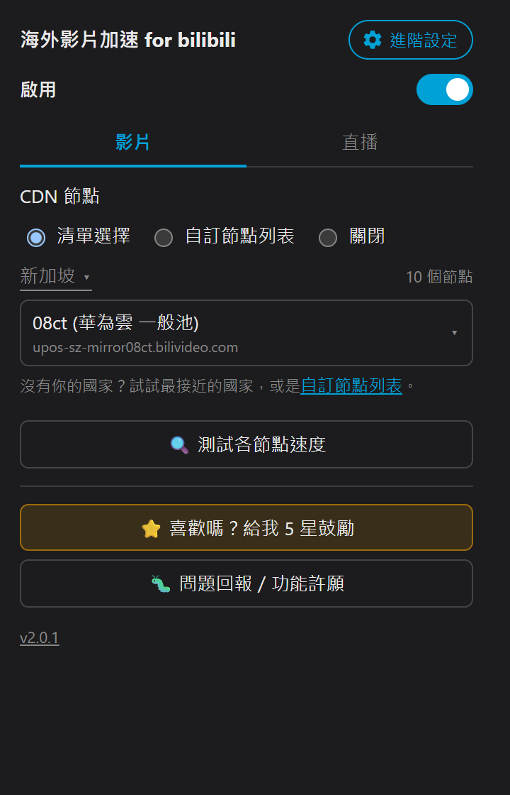

<div align="center">

# 🎬 B 站 CDN 線路重排

**語言 / Language：** 繁體中文（本頁）｜[简体中文](README.zh-CN.md)｜[English](../README.md)｜[日本語](README.ja.md)｜[한국어](README.ko.md)

### 讓海外用戶看網頁版 B 站更順的 Chrome / Firefox / Edge / Safari 擴充

### 📥 [Chrome Web Store](https://chromewebstore.google.com/detail/dfaddcffoondcendifiljhdbdagebgch?utm_source=github&utm_medium=referral&utm_campaign=readme&utm_content=zhtw) ｜ [Firefox Add-ons](https://addons.mozilla.org/addon/bilibili-cdn-switcher?utm_source=github&utm_medium=referral&utm_campaign=readme&utm_content=zhtw) ｜ [Edge Add-ons](https://microsoftedge.microsoft.com/addons/detail/dllallgilijcacpdemjafegibdafcbdp?utm_source=github&utm_medium=referral&utm_campaign=readme&utm_content=zhtw) ｜ Safari（App Store，即將上架）

</div>

---

<div align="center">



</div>

---

使用前（關閉擴充）


使用後（啟用擴充）


## ✨ 這個擴充在做什麼

**🎯 主要是為了讓海外（中國大陸以外）的使用者看網頁版 B 站（www.bilibili.com）更順。**

B 站預設分配的取流節點對海外使用者常常繞路、不夠快。這個擴充會**把影片的取流 CDN 重排、換成一個對你所在地區實測較快的最優節點**，讓緩衝與載入更順。

| 功能 | 說明 |
|:--|:--|
| 🚀 **所在地區最優節點** | 預設換成你所在國家實測最快的 CDN（已實測台灣／新加坡，其他國家陸續上線），開箱即用；安裝後或切換國家時，第一支影片會在背景測速一次並換成最快的節點 |
| 🌐 **其他 CDN 節點** | 阿里雲／騰訊雲／華為雲／Akamai／各海外節點…，依所在地區自由比較切換 |
| ✏️ **自訂節點列表** | 跟「清單選擇」互斥的另一個模式：可加入多個任意 CDN host，同樣支援測速與排序；官方測速工具 **CDNSpeedTest**（Windows）測完會把推薦節點自動加進來 |
| 🛑 **關閉** | 影片／直播各有獨立的「關閉」選項：不介入 CDN 選線、完全維持 B 站官方原始邏輯 |
| 📺 **直播支援** | 「直播」分頁可在 國際線路(ov)／國際備用線路(ov-b)／中國線路(cn)／中國備用線路(cn-b) 之間切換，不整頁重載；進入直播間播放後才會顯示各線路的實際網址，當前直播沒有的線路會標註並變淡（仍可選）。直播線路不佳時，「失敗自動切換」會自動退回國際線路(ov)（只針對該直播間，不改變你長期的選擇） |
| 🔁 **失敗自動切換** | 偵測到目前 CDN 分段請求失敗、或播放持續卡住（非單純緩衝已滿），先靜默切換到 B 站原生給的備援節點（顯示提示、不整頁刷新）；備援也不行時彈出提示，讓你自行決定是否切到「備用URL」。可在彈出視窗的「失敗自動切換」開關關閉（預設開啟）；網路本身不穩時建議關閉 |
| 📶 **各節點測速** | 獨立頁面（影片、直播各一個），顯示影片標題／畫質，實測當前影片、當前畫質下各節點的下載速度並逐一列出，測速中也能重新測；不影響你手動選擇的 CDN，離開該頁即中止 |
| 🌏 **多語系介面** | 依瀏覽器語言自動顯示繁體中文／简体中文／English／日本語／한국어（也可在進階設定手動選擇），涵蓋 popup、頁面提示與 debug 疊層 |
| 🐛 **debug 疊層** | 查看當前 CDN 節點（預設關閉，可在右上角齒輪的進階設定中打開） |
| 🦊 **Chrome / Firefox / Edge / Safari 四平台** | 同一份 `src/`，打包時依瀏覽器各自產生 zip（Edge 是 Chromium 內核，直接沿用 Chrome 的 manifest）；Safari 另用 Xcode 包成 `.app`（見下方「打包 Safari」） |

---

## 🗂️ 專案結構

```text
bilibili-cdn-switcher/
├── src/                  ← 擴充本體（載入未封裝 / 打包的就是這層）
│   ├── manifest.json          ← Chrome / Edge 用
│   ├── manifest.firefox.json  ← Firefox 用（含 browser_specific_settings）
│   ├── popup.html / popup.js
│   ├── main-hook.js      ← MAIN world：改寫取流 URL
│   ├── bridge.js         ← ISOLATED world：storage / i18n ↔ 頁面 橋接
│   ├── cdn-list.json     ← 節點清單
│   ├── _locales/{zh_TW,zh_CN,en,ja,ko}/  ← 五語系文案（manifest 用 __MSG_x__ 引用；popup.js／main-hook.js 執行期查表）
│   └── icons/            ← 16 / 32 / 48 / 128
├── dist/                 ← 打包產物（Chrome/Firefox/Edge 是 .zip；Safari 是 .app）
├── docs/                 ← README 用的截圖 + 繁體中文／简体中文／日本語／한국어 README
├── assets/               ← 圖示母檔 512px（icons-prod 由 gen-icons.mjs 產生）
├── store/                ← 各商店上架用截圖 / 宣傳圖 + 各平台五語系介紹文字
├── safari/               ← Safari 擴充的 Xcode 工程（safari-web-extension-converter 產生，內含擴充資源用相對路徑直接引用 ../../../src/）
├── scripts/              ← 所有開發／打包腳本，純 Node，Windows／Mac／Linux 都能跑
│   ├── build.mjs                 ← 打包成上架用 zip（Chrome + Firefox + Edge）
│   ├── build-safari.mjs          ← 用 Xcode 打包 Safari 擴充成 .app（macOS-only）
│   ├── changelog.mjs             ← 驗證 src/changelog.json；pre-push hook 用它檢查清單有沒有更新
│   ├── release.mjs               ← 發版機械步驟（升版號、把 unreleased 搬進新版本）
│   ├── publish-stores.mjs        ← 用 API 金鑰上傳新版 zip 到 Chrome / Edge / Firefox（不會按發布）
│   ├── test-whats-new.mjs        ← 用真的 Chrome 測「更新內容」popup
│   ├── gen-icons.mjs             ← 重新產生圖示
│   └── capture-screenshots.mjs   ← 自動開瀏覽器截五語系商店截圖（見下）
├── package.json           ← scripts/*.mjs 用的 Node 依賴（jszip / puppeteer / sharp）
├── .env.local.example     ← 截圖用登入 cookie 的範例（複製成 .env.local 再填，見下）
└── README.md
```

所有 `scripts/` 底下的工具都是純 Node（配 [jszip](https://npm.im/jszip) 打包 zip、[sharp](https://npm.im/sharp) 處理圖片），
不依賴 Windows 專屬的 PowerShell／System.Drawing，Mac／Linux 一樣能跑，只要先 `npm install` 裝好依賴即可。

### 📦 打包（上架 Chrome Web Store / Firefox Add-ons / Microsoft Edge Add-ons 用）

這個專案不需要編譯／transpile，`src/` 底下就是可直接 `Load unpacked` 的原始碼；「打包」只是把它壓成上架用的 zip，
**沒有自動化（例如 push 前自動打包）**，要更新 `dist/` 得自己手動跑一次：

```bash
npm install                          # 第一次執行，或 node_modules 被清掉時才需要
npm run build                        # 預設：Chrome + Firefox + Edge 都打包
npm run build -- --browser=chrome     # 只打包 Chrome
npm run build -- --browser=firefox    # 只打包 Firefox
npm run build -- --browser=edge       # 只打包 Edge
```

Chrome／Edge 用同一份 `src/manifest.json`（Edge 是 Chromium 內核，Manifest V3 與 Chrome 完全相容，
不需要另外的 manifest），Firefox 用 `src/manifest.firefox.json`。會讀對應 manifest 的 `version`，
把 `src/` **底下的內容**（manifest 換成 `manifest.json` 放在 zip 最上層）壓成
`dist/bilibili-cdn-switcher-<browser>-<版本>.zip`。Chrome／Firefox 兩份 manifest 的 `version`
要保持一致，不一致時腳本會跳警告（Edge 沿用 Chrome 的 manifest，版本必然一致，不用另外檢查）。

打包結果是可重現的（reproducible build）：只要 `src/` 內容沒變，同一個瀏覽器目標每次包出來的
zip bytes 完全相同（跨 Windows／Mac 也一樣），方便日後要接 CI 時判斷 `dist/` 是否真的需要更新。

### 📝 更新紀錄與發版

- `src/changelog.json` 同時記「尚未上架的新功能（`unreleased`）」與「各已上架版本相較前一版追加的內容（`releases`）」，五語（zh_TW / zh_CN / en / ja / ko）。
  老使用者更新後第一次開設定選單，會看到一次性的「更新內容」popup（內容就來自這份檔案；打包進 zip 時會自動拿掉 `unreleased`）。
- `.githooks/pre-push`：push 時若相較於分支出來的基準 `src/changelog.json` 沒有變動，會詢問是否仍要 push，選 No 就擋下。
  `npm install` 會自動設定 `core.hooksPath`（或手動 `git config core.hooksPath .githooks`）。確定不需要記錄時：`CHANGELOG_CHECK_IGNORE=1 git push`。
- 發版用 Claude Code 的 `/release`（`.claude/skills/release/SKILL.md`）；上架金鑰放 `.env.local`（見 `.env.local.example`）。商店的「發布」按鈕一律人工按。
- `npm run test:whats-new`：用 puppeteer 的 Chrome 載入 `src/`，自動測更新提示 popup。

### 🍎 打包 Safari（上架 App Store 用）

Safari 擴充不能像 Chrome 那樣直接載入 zip，必須包成一個「內含擴充的 App」（macOS 是 `.app`、iOS 是 `.ipa`），
透過 App Store 分發。`safari/` 底下就是 `xcrun safari-web-extension-converter` 產生的 Xcode 工程，裡面用相對路徑
（`../../../src/`）直接引用倉庫的 `src/`，所以**改 `src/` 不需要同步任何檔案**，重新打包就會帶到最新內容；換到任何一台
Mac clone 整個倉庫都能跑（工程裡沒有寫死的絕對路徑）。

**需求**：一台裝了完整 Xcode 的 Mac（只有 Command Line Tools 不夠）。

```bash
npm run build:safari                       # macOS，Release，ad-hoc 簽章 → dist/
npm run build:safari -- --platform=ios     # 改打包 iOS
npm run build:safari -- --configuration=Debug
```

腳本會呼叫 `xcodebuild`，並把 `MARKETING_VERSION` 覆蓋成 `src/manifest.json` 的 `version`（讓 .app 內部版本跟擴充一致，
Xcode 工程預設寫死 1.0），產出兩個東西：

- `dist/Bilibili CDN Switcher (<平台>).app` —— 可直接雙擊安裝／測試的 App
- `dist/bilibili-cdn-switcher-safari-<平台>-<版本>.zip` —— 對齊其他平台的 `bilibili-cdn-switcher-<平台>-<版本>` 命名規範，方便傳給別台機器

⚠️ 這裡是 **ad-hoc 簽章，只供本機測試**。真正上架 App Store 仍需在 Xcode 開啟 `safari/` 裡的工程 →
Product > Archive > Distribute App，用你的 Apple Developer 帳號簽章上傳（這步需要簽章憑證，無法純命令列完成）。

### 🎨 重新產生圖示

```bash
npm run gen-icons
```

以 512px 母檔縮出 16/32/48/128，同時產生兩份：`src/icons/`（開發版，帶紅點角標，`Load unpacked` 平常讀到的就是這份，方便跟已安裝的正式版分辨）與 `assets/icons-prod/`（正式版，無角標）。`scripts/build.mjs` 打包 zip 時會自動把圖示換成 `assets/icons-prod/` 底下的正式版。

### 📸 產生商店截圖（五語系 × 五個畫面，共 25 張 1280x800 png）

```bash
npm run capture-screenshots                      # 預設 1280x800（Chrome 商店固定要這尺寸）
npm run capture-screenshots -- --size=2560x1600  # Mac App Store 用的高解析版；檔名帶尺寸，另存一套不覆蓋 1280x800
```

用 Puppeteer 載入 unpacked 的 `src/`，依序切 `en-US`／`zh-CN`／`zh-TW`／`ja`／`ko` 五個瀏覽器語系，實際打開一支
bilibili 影片頁（網址寫在 `scripts/capture-screenshots.mjs` 開頭的 `VIDEO_URL`，要換片直接改那行），
分別截點播主頁、直播主頁、點播測速頁（測速中）、進階設定頁、頁面上的 debug 疊層五張，等比縮放＋黑邊填成
1280x800，輸出到 `store/` 覆蓋同名檔案（`screenshot-<語系>-<序號>-<畫面>-1280x800.png`，語系在前，
依檔名排序時同語系會排在一起並照畫面順序）。直播主頁的直播間從 B 站推薦清單動態挑選，
要固定房間可在 `.env.local` 設 `LIVE_ROOM=<房號>`。因為要連真實 bilibili 影片頁測速，跑一輪約
數分鐘，且吃網路狀況。

`--locale=en|zhcn|zhtw|ja|ko` 可只跑單一語系。`docs/` 裡 README 用的圖不由腳本產生，是手動維護的。

**登入 cookie（選用，決定截圖畫質）**：未登入時 B 站只給約 480P，截圖裡的 `qn` 就會是 480P。
想要高畫質截圖的話，把 `.env.local.example` 複製成 `.env.local`，填入自己的 `BILI_COOKIE`
（登入 B 站 → DevTools → Network → 任一請求 → Request Headers → 複製整段 Cookie）。
腳本有讀到就帶登入狀態開影片頁，沒有這個檔就照舊用未登入狀態跑，其餘流程完全一樣。
`.env.local` 已列入 `.gitignore`，**裡面的 `SESSDATA` 等同帳號憑證，不要 commit 或外傳**。

---

## 🎛️ UI 說明

| 選項 | 行為 |
|:--|:--|
| ⚙️ **進階設定（右上角齒輪）** | 「失敗自動切換」與「顯示頁面 debug 疊層」兩個開關收在這裡（各附白話說明），開啟 debug 疊層時同一區會顯示目前分頁的 debug 資訊；主頁標題顯示擴充在當前語系的正式名稱，「⭐ 給我 5 星鼓勵」與「🐛 問題回報」是主頁最下方的兩顆按鈕 |
| 🔘 **啟用** | 預設 **開啟** 的總開關，同時管影片與直播；關閉後完全不改動 B 站取流（debug 疊層仍會顯示當前 CDN） |
| 🎞️ **影片／直播分頁** | 「啟用」下面分成「影片」「直播」兩個分頁；目前分頁是直播間時，打開會自動停在「直播」 |
| 📡 **CDN 線路** | 「清單選擇」／「自訂節點列表」／「關閉」互斥單選。**預設＝清單選擇**。清單上方可選**國家**（台灣／新加坡／全部），只列出該國實測最快的 10 個節點（依研究報告排序，預設第一項 08ct），最後一項是「備用URL」；旁邊標示目前選項有幾個節點。選「全部」會列出全部約 300 個節點。新安裝與更新後第一次打開時，會依 IP 自動選你所在的國家並標「你在這裡」（查詢 B 站自己的 zone API，不需新增權限）；不在清單內的國家預設台灣。剛安裝時節點預設為該國第一個；切換國家時節點會改成該國第一個，「節點按測速排序」排出的順序會清掉、回到該國原始排序；切到「自訂節點列表」可輸入多個節點網址或 host 加入列表（CDNSpeedTest 測完也會自動加入），同樣能測速與排序；「關閉」只作用於一般影片，不介入影片 CDN 選線 |
| 📺 **直播線路** | 「偏好選擇」／「關閉」二選一，**預設＝偏好選擇，國際線路(ov)**。四個線路是同一個直播間、同一集群號下的 `ov`／`ov-b`／`cn`／`cn-b` 變體（B 站直播的簽名只在同號之間通用，點播那些節點對直播無效）；記住的是「線路種類」而非具體 host |
| 📺 **測試各直播線路速度** | 只有在直播間播放時才能測；先檢查四條線路是否都存在（不存在的不測），再對每條線路測兩項：**切台卡頓**（連測 3 次取平均的起播時間，0–800ms 低／800–1500ms 中／超過 1500ms 高，分別以綠／黃／紅字顯示）與**持續觀看**（拉 8 秒，完全跟上＝綠字「優秀」、掉隊 1 秒內＝黃字「中等」、超過 1 秒＝紅字「差勁」）。測速會與正在播放的直播搶頻寬 |
| 🔍 **測試各節點速度** | 按下後切到獨立的測速頁面，上方顯示目前影片標題與畫質；抓「當前影片、當前畫質」的分段，依序換各節點 host 實測下載速度（8MB 或 5 秒先到為準，5 秒內完全沒收到資料才算超時；有收到但不到 8MB 就顯示實際測到的速度），只測目前國家清單內的節點，逐格顯示「等待中／測試中／結果」，最快的前三名在右上角戴上金／銀／銅皇冠；選「全部」時開測前會先跳紅色警告並估算耗時（節點數 × 每節點秒數上限），引導改選國家。可按「🔄 重新測速」重跑（測速中也能按，會中斷目前的重新開始）。**只顯示數字，不會更動你目前選擇的 CDN**；按左上角「← 返回」或關掉 popup 會立即中止測速。開啟「啟用」時，playurl 一解析完就能測，不用等真的開始播放；若「啟用」是關閉的，則要等實際下載過分段才有樣本 |
| 🔁 **失敗自動切換 CDN** | 預設開啟，可在進階設定關閉（網路本身不穩、如 WiFi 訊號弱時建議關閉，避免頻繁黑屏重載）；開啟時偵測到分段請求失敗（403/404/5xx/網路錯誤）或播放確實卡住（8 秒內進度不動、且線路上也沒有資料在動），先靜默切到 B 站原生給的備援節點（分段層即時差替、不整頁刷新，並跳出提示）；這個備援也播不動時，改彈出一個不會自動消失的提示，讓你自己決定要不要「重載並切換至備用URL」。直播間則是：先檢查你選的線路在這個直播是否存在（不存在就直接退回國際線路 ov），之後持續一段時間沒有碼流也退回 ov |
| ⚡ **影片自動測速並切換到最快節點** | 在進階設定中；預設 **關閉**。每支影片先用目前選的節點播，第一個分段下載完約 5 秒後，在背景依「測速門檻」逐一測速目前國家清單的節點，測完自動把選擇的節點換成最快的並存起來（同一支影片只測一次）。國家選「全部」時無法使用。由於每次測速名次都不同，幾乎每支影片都會因切換 CDN 黑畫面一次，選定節點大多能順暢播放時不建議開；擔心卡頓請改用「失敗自動切換」 |
| 🌏 **語言** | 預設跟隨瀏覽器／作業系統語言，自動顯示繁體中文／简体中文／English／日本語／한국어（其餘語言顯示英文）；如需強制指定，可在 popup 的「進階設定 → 語言」選擇 |
| 🎨 **外觀主題** | popup 的「進階設定 → 外觀主題」：跟隨系統（預設，依作業系統的淺色／深色設定）／淺色／深色。淺色為淺灰底、白色卡片配 B 站粉，風格同測速工具 CDNSpeedTest；深色為原本的深色設計 |
| ⏱️ **測速門檻** | 在進階設定中，分「影片」「直播」兩區：影片是每個節點最多下載幾 MB／最多測幾秒（預設 8MB／5 秒，先到為準）；直播是切台卡頓測幾次取平均／持續觀看每條線路測幾秒（預設 3 次／8 秒）。調整後永久儲存，各區有「恢復預設」 |
| 🔢 **節點按測速排序** | 在進階設定中；預設 **關閉**。開啟後，測速時每測完一個節點就以平移動畫排到「由快到慢」的位置（影片看下載速度；直播先看持續觀看等級，同級再比切台卡頓）。排出的順序存在本機，主畫面的節點清單也照這個順序，直到下次重新測速；關閉即恢復預設順序 |
| 🐛 **顯示頁面 debug 疊層** | 在進階設定中；預設 **關閉**；獨立於重排開關，關閉重排時仍可顯示當前 CDN，方便比較 |

<details>
<summary>🔍 <b>Debug 疊層長什麼樣</b>（播放器左上角）</summary>

```text
mode=on  target=upos-sz-mirror08ct.bilivideo.com
cdn=<當前實際串流的 host>
v=<video 主用 host>  a=<audio 主用 host>
src=playinfo|playurl  rw=<改寫次數>  seg=<分段差替數>  qn=<畫質>
```

</details>

---

## 🗂️ 設定與檔案

- 📋 節點清單放在 **`src/cdn-list.json`**，直接手動編輯：
  收錄 300 多個點播節點（已去重，並排除直播節點與確定失效的節點），
  各國的 `nodes` 是依 CDN 池分散的建議前 10 名。測速程式（`tools/cdn-speedtest-app`）的報告收集後用 `/analyze-cdn` 分析，再依分析結果更新 `countries`。
- 🧩 格式：

  ```json
  {
    "countries": [{ "code": "TW", "dial": 886, "name": { "zh_TW": "台灣", "zh_CN": "台湾", "en": "Taiwan" }, "nodes": ["upos-sz-mirror08ct.bilivideo.com", "…"] }],
    "pools": { "hw-biliv6": { "zh_TW": "華為雲 一般池", "zh_CN": "华为云 常规池", "en": "Huawei Cloud" } },
    "options": [{ "value": "upos-sz-mirror08ct.bilivideo.com", "name": "08ct", "pool": "hw-biliv6" }]
  }
  ```

  `options` 是全部節點（也是「全部」選項的順序），顯示成「代號 (池類型)」；`countries[].nodes` 第一項為該國預設；`dial` 是國際電話區碼，用來對應 B 站 zone API 回傳的 `country_code`。
  `value` 特殊值：🔁 `backup`＝優先備用URL（固定放最後，用 `nameKey` / `noteKey` 對應語系檔）。「關閉」與「自訂節點列表」是 popup 獨立的模式，不在清單裡。

---

## ⚠️ 注意

- 🔒 一律保留原 host 為 `backupUrl` fallback，避免個別 host-bound URL 整段播不出。
- 📍 預設節點已在台灣、新加坡實測，其他國家陸續上線；其他地區使用者可自行切換到較近的節點，或用「自訂節點列表」加入自己的 host（可用測速工具 CDNSpeedTest 找出來）。
- 📶 「測試各節點速度」是短時間實測單一分段，結果僅供參考：CDN 是否已對這支影片、這個畫質建立快取，
  以及路由在不同時段的壅塞狀況都會影響實際觀看體驗，測速當下最快不代表長時間播放最順。

---

## 📜 授權 License

原始碼公開，採自訂的 **[Source-Available License](../LICENSE)**：

- ✅ 可以查看、Fork、修改原始碼，個人使用、教學／研究等非商業用途皆可自由進行
- ❌ 不可將本專案或修改版重新包裝成競爭性的瀏覽器擴充／App／服務並對外發佈上架，也不可移除版權聲明
- 完整條款請見 [LICENSE](../LICENSE)；商業合作或例外授權需求歡迎開 issue 聯絡

隱私權政策：[PRIVACY.md](../PRIVACY.md)

---

<div align="center">

Made with ❤️ for 🇹🇼 / 🇸🇬 bilibili viewers · 靈感致謝 [@roge4444](https://github.com/roge4444) 的 [PiliNaraRogerMod](https://github.com/roge4444/PiliNaraRogerMod) ／ [blblRogerMod](https://github.com/roge4444/blblRogerMod)

</div>
